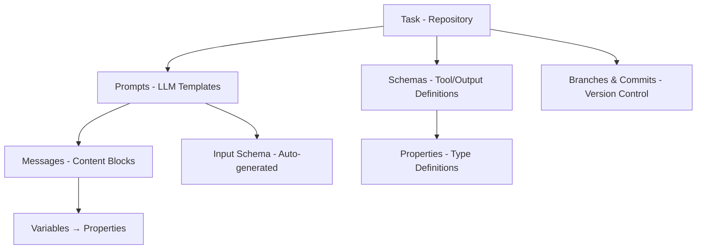
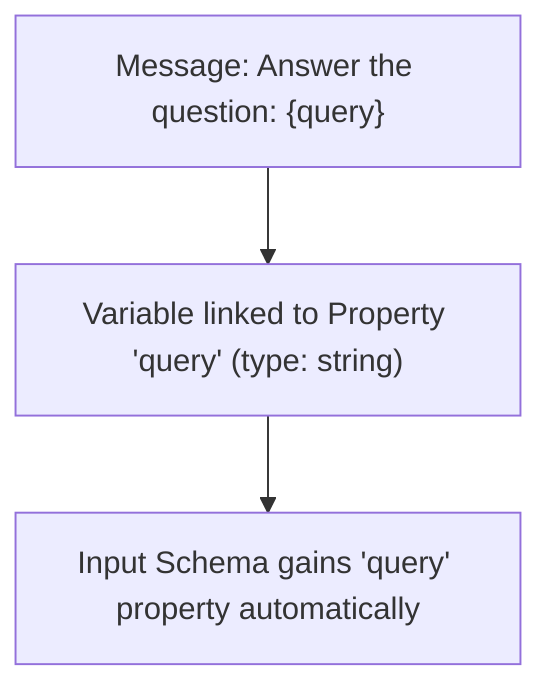
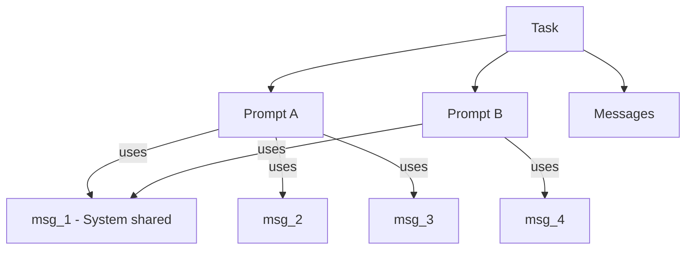
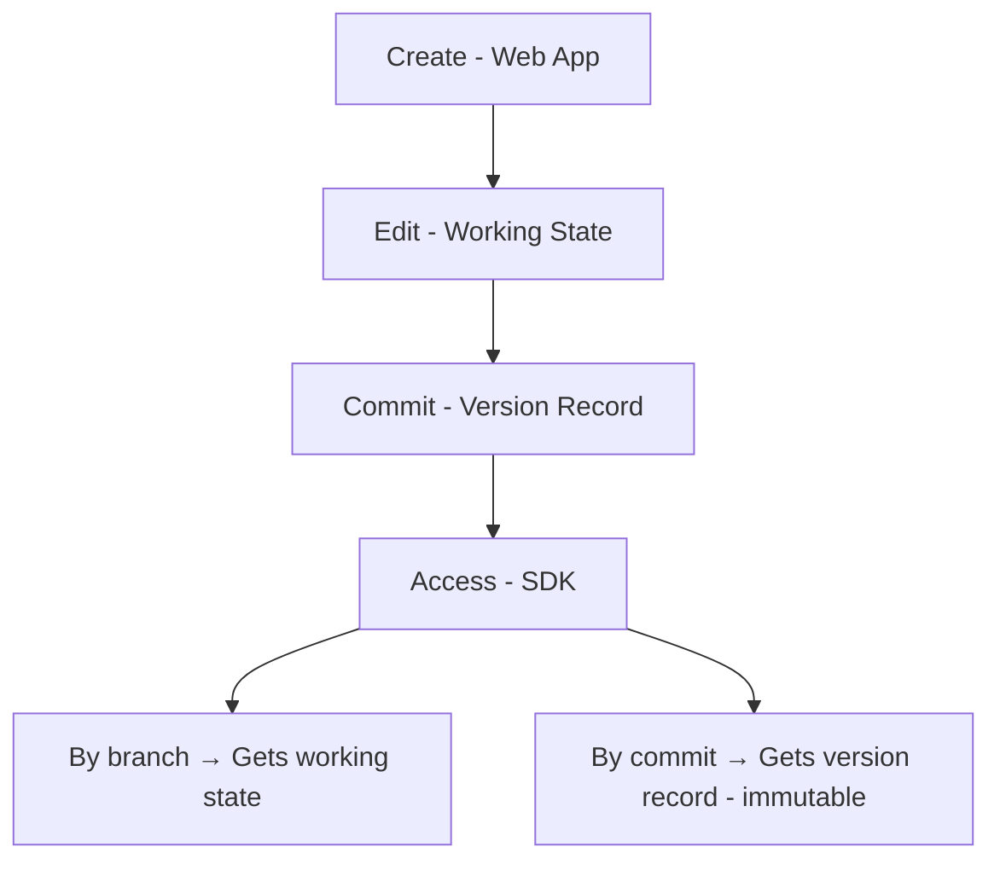

Moxn organizes content in a hierarchical structure designed for collaboration and reuse. This guide explains each entity type and how they relate.

## Entity Hierarchy



## Task

A **Task** is the top-level container, analogous to a Git repository. It groups related prompts and provides version control boundaries.

```python
task = await client.get_task("task-id", branch_name="main")

task.id           # UUID - stable identifier
task.name         # str - e.g., "Customer Support Bot"
task.description  # str | None
task.prompts      # list[PromptTemplate]
task.definitions  # dict[str, SchemaDefinition] - all schemas
task.branches     # list[Branch]
task.last_commit  # Commit | None
```

**Use cases for Tasks:**
- One task per AI feature (customer support, search, etc.)
- One task per team or domain
- One task per environment (if you prefer separate staging/production)

## Prompt

A **Prompt** (or PromptTemplate) is a template for a single LLM invocation. It combines messages, an input schema, and optional tool definitions.

```python
prompt = await client.get_prompt("prompt-id", branch_name="main")

prompt.id              # UUID
prompt.name            # str - e.g., "Product Help"
prompt.description     # str | None
prompt.task_id         # UUID - parent task
prompt.messages        # list[Message]
prompt.input_schema    # Schema | None - auto-generated from variables
prompt.tools           # list[SdkTool] - function calling tools
prompt.completion_config  # CompletionConfig - model settings
```

### Completion Config

Each prompt can specify default model settings:

```python
prompt.completion_config.provider    # Provider enum
prompt.completion_config.model       # str - e.g., "claude-sonnet-4-20250514"
prompt.completion_config.max_tokens  # int
prompt.completion_config.temperature # float
prompt.completion_config.tool_choice # str - "auto", "required", "none", or tool name
```

### Tools

Prompts can have tools for function calling or structured output:

```python
# Function calling tools
prompt.function_tools  # list[SdkTool] where tool_type == "tool"

# Structured output schema
prompt.structured_output_schema  # SdkTool | None where tool_type == "structured_output"
```

## Message

A **Message** is a reusable content block with a specific role. Messages can be shared across multiple prompts.

```python
for message in prompt.messages:
    message.id           # UUID
    message.name         # str - e.g., "System Prompt"
    message.role         # "system" | "user" | "assistant"
    message.author       # "HUMAN" | "MACHINE"
    message.blocks       # list[list[ContentBlock]] - 2D content
    message.task_id      # UUID - parent task
```

### Message Roles

| Role | Description |
|------|-------------|
| `system` | Instructions for the LLM (converted to system param for Anthropic/Google) |
| `user` | User input or context |
| `assistant` | Assistant responses (for few-shot examples or prefilling) |

### Content Blocks

Messages contain **blocks** in a 2D array structure:

```python
message.blocks  # list[list[ContentBlock]]
# Outer array: paragraphs or logical sections
# Inner array: blocks within a paragraph
```

**Block types:**

```python
# Text
TextContent(text="You are a helpful assistant.")

# Variables (substituted at runtime)
Variable(
    name="query",
    variable_type="primitive",  # or "image", "file"
    format="inline",            # or "block"
    description="The user's question",
    required=True
)

# Images
ImageContentFromSource(url="https://...", alt="description")
SignedURLImageContent(signed_url="...", file_path="...", expiration=datetime)

# PDFs
PDFContentFromSource(url="https://...", name="document.pdf")
SignedURLPDFContent(signed_url="...", file_path="...", expiration=datetime)

# Tool interactions
ToolCall(tool_name="search", tool_call_id="...", input={...})
ToolResult(tool_call_id="...", content="...")

# Extended thinking
ThinkingContent(text="Let me reason about this...")
ReasoningContent(text="Step 1: ...")
```

## Property

A **Property** is a type definition that describes a variable. Properties define the shape of data that flows into prompts.

Properties are composed into schemas and linked to variables in messages by name.

**Property definition (JSON Schema):**

```json
{
  "type": "object",
  "properties": {
    "query": {
      "type": "string",
      "description": "The user's question"
    },
    "context": {
      "type": "array",
      "items": {
        "type": "object",
        "properties": {
          "title": {"type": "string"},
          "content": {"type": "string"}
        }
      }
    }
  },
  "required": ["query"]
}
```

**Supported types:**
- Primitives: `string`, `number`, `integer`, `boolean`
- Complex: `object`, `array`
- Formats: `date`, `date-time`, `email`, `uri`, `uuid`

## Schema

A **Schema** is a compiled JSON Schema definition, either:
- **Input schema**: Auto-generated from variables in a prompt's messages
- **Tool schema**: Manually created for function calling or structured output

```python
schema = prompt.input_schema

schema.id           # UUID
schema.name         # str - e.g., "ProductHelpInput"
schema.description  # str | None
schema.exportedJSON # str - JSON Schema as string
```

### Input Schema Auto-Sync

When you add variables to messages, the input schema updates automatically:



This keeps your schema in sync with your actual prompt content.

### Schema Definitions

Access full schema definitions via the task:

```python
task = await client.get_task("task-id")

for name, definition in task.definitions.items():
    print(f"Schema: {name}")
    print(f"  Type: {definition['type']}")
    print(f"  Properties: {list(definition.get('properties', {}).keys())}")

    # Moxn metadata embedded in schema
    metadata = definition.get("x-moxn-metadata", {})
    print(f"  Schema ID: {metadata.get('schema_id')}")
    print(f"  Prompt ID: {metadata.get('prompt_id')}")
```

## Relationships

### Pass-by-Reference

Messages are **referenced**, not copied, across prompts:



This means:
- Updating a shared message updates all prompts using it
- Each prompt still gets its own copy at fetch time (SDK doesn't maintain live references)
- Reuse is tracked in the web app for easier management

### Anchor IDs

Every entity has a stable **anchor ID** that never changes:

```python
prompt.id  # UUID - stable across all branches and commits
```

When you fetch a prompt from different branches, the ID stays the same. Only the content changes.

This enables:
- Referencing prompts in code without worrying about versions
- Tracking the same entity across branches
- Stable foreign key relationships

## Entity Lifecycle



See [Versioning](/concepts/versioning) for details on branches and commits.

## Next Steps

<CardGroup cols={2}>
  <Card title="Versioning" icon="code-branch" href="/concepts/versioning">
    Understand branches and commits
  </Card>
  <Card title="Variables & Schemas" icon="brackets-curly" href="/concepts/variables">
    Deep dive into the variable system
  </Card>
  <Card title="Working with Prompts" icon="file-lines" href="/guides/prompts">
    Fetch and use prompts in code
  </Card>
  <Card title="Web App: Creating" icon="browser" href="/webapp/creating">
    Create entities in the web app
  </Card>
</CardGroup>
