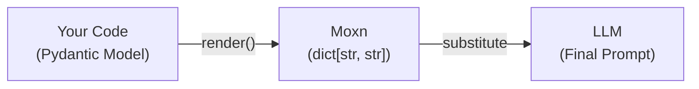
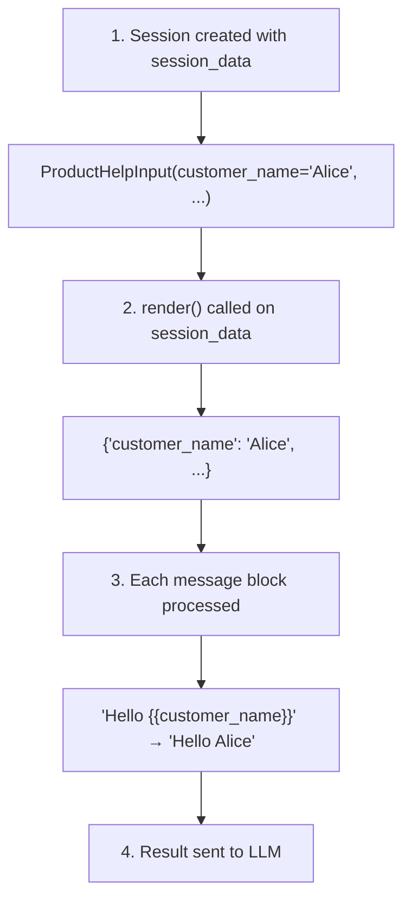

Variables are the bridge between your application data and your prompts. This guide explains how the variable system works.

## The Variable System



## How Variables Work

### 1. Define Variables in Messages

In the web app, insert variables using the `/variable` command:

```
System: You are a customer support agent for {{company_name}}.

User: Customer {{customer_name}} asks:
{{query}}

Relevant context:
{{search_results}}
```

Each `{{variable_name}}` links to a **Property** that defines its type.

### 2. Variables Sync to Schema

When you add variables, the prompt's **input schema** updates automatically:

```json
{
  "type": "object",
  "properties": {
    "company_name": {"type": "string"},
    "customer_name": {"type": "string"},
    "query": {"type": "string"},
    "search_results": {"type": "string"}
  },
  "required": ["query"]
}
```

This happens in real-time as you edit—no manual schema management.

### 3. Provide Data at Runtime

At runtime, provide values that match the schema:

```python
session = await client.create_prompt_session(
    prompt_id="...",
    session_data=ProductHelpInput(
        company_name="Acme Corp",
        customer_name="Alice",
        query="How do I reset my password?",
        search_results="[relevant docs as JSON]"
    )
)
```

### 4. Variables Get Substituted

When converting to provider format, variables are replaced:

```python
# Original message block
"Customer {{customer_name}} asks: {{query}}"

# After substitution
"Customer Alice asks: How do I reset my password?"
```

## Properties

A **Property** defines the type and metadata for a variable.

### Property Types

| Type | JSON Schema | Python | Use Case |
|------|-------------|--------|----------|
| String | `{"type": "string"}` | `str` | Text, IDs |
| Number | `{"type": "number"}` | `float` | Scores, prices |
| Integer | `{"type": "integer"}` | `int` | Counts |
| Boolean | `{"type": "boolean"}` | `bool` | Flags |
| Object | `{"type": "object", ...}` | Nested model | Structured data |
| Array | `{"type": "array", ...}` | `list[T]` | Collections |

### Special Formats

String properties can have formats:

```json
{
  "type": "string",
  "format": "date"        // "2024-01-15"
}
{
  "type": "string",
  "format": "date-time"   // "2024-01-15T10:30:00Z"
}
{
  "type": "string",
  "format": "email"       // "user@example.com"
}
{
  "type": "string",
  "format": "uri"         // "https://example.com"
}
```

### Complex Properties

Properties can define nested structures:

```json
{
  "type": "object",
  "properties": {
    "id": {"type": "string"},
    "title": {"type": "string"},
    "content": {"type": "string"},
    "score": {"type": "number"}
  },
  "required": ["id", "title", "content"]
}
```

Or arrays of complex objects:

```json
{
  "type": "array",
  "items": {
    "type": "object",
    "properties": {
      "title": {"type": "string"},
      "content": {"type": "string"}
    }
  }
}
```

## The render() Transformation

### Why render()?

Variables must be **strings** for prompt injection, but your code uses **typed data**.

The `render()` method bridges this gap:

```python
class ProductHelpInput(RenderableModel):
    customer_name: str           # Simple: just use as-is
    query: str
    documents: list[Document]    # Complex: needs serialization

    def render(self, **kwargs) -> dict[str, str]:
        return {
            "customer_name": self.customer_name,
            "query": self.query,
            "documents": json.dumps([d.model_dump() for d in self.documents])
        }
```

### render() Input vs Output

```python
# Input (typed)
input = ProductHelpInput(
    customer_name="Alice",
    query="How do I...",
    documents=[
        Document(title="FAQ", content="..."),
        Document(title="Guide", content="...")
    ]
)

# Output (all strings)
output = input.render()
# {
#   "customer_name": "Alice",
#   "query": "How do I...",
#   "documents": '[{"title": "FAQ", ...}, {"title": "Guide", ...}]'
# }
```

### Customizing Format

Override `render()` to control formatting:

```python
def render(self, **kwargs) -> dict[str, str]:
    # Markdown format
    docs_md = "\n".join([
        f"## {d.title}\n{d.content}"
        for d in self.documents
    ])

    return {
        "customer_name": self.customer_name,
        "query": self.query,
        "documents": docs_md
    }
```

Or XML:

```python
def render(self, **kwargs) -> dict[str, str]:
    docs_xml = "<documents>\n" + "\n".join([
        f'  <doc title="{d.title}">{d.content}</doc>'
        for d in self.documents
    ]) + "\n</documents>"

    return {
        "customer_name": self.customer_name,
        "query": self.query,
        "documents": docs_xml
    }
```

## Schemas

### Input Schemas

Every prompt has an **input schema** that defines required variables:

```python
prompt = await client.get_prompt("...", branch_name="main")

# Access the input schema
schema = prompt.input_schema
print(schema.name)         # "ProductHelpInput"
print(schema.exportedJSON) # Full JSON Schema
```

Input schemas are **auto-generated** from message variables. You don't create them manually.

### Tool Schemas

Tool schemas define function calling or structured output:

```python
# Access tool schemas
for tool in prompt.tools:
    if tool.tool_type == "tool":
        print(f"Function: {tool.name}")
        print(f"Schema: {tool.schema}")
    elif tool.tool_type == "structured_output":
        print(f"Output schema: {tool.name}")
```

Tool schemas are created manually in the web app.

## Variable Substitution

### How It Works



### Variable Formats

Variables can be **inline** or **block**:

| Format | Example | Description |
|--------|---------|-------------|
| **Inline** | `The customer {{customer_name}} said...` | Variable embedded in text |
| **Block** | `{{search_results}}` | Variable is entire block |

This affects rendering—block variables typically appear on their own line.

## Schema Metadata

Schemas include Moxn metadata:

```json
{
  "type": "object",
  "properties": {...},
  "x-moxn-metadata": {
    "schema_id": "uuid",
    "prompt_id": "uuid",
    "task_id": "uuid",
    "commit_id": "abc123"  // If from a commit
  }
}
```

Codegen'd models expose this:

```python
class ProductHelpInput(RenderableModel):
    @classmethod
    @property
    def moxn_schema_metadata(cls) -> MoxnSchemaMetadata:
        return MoxnSchemaMetadata(
            schema_id="...",
            prompt_id="...",
            task_id="..."
        )
```

## Best Practices

<AccordionGroup>
  <Accordion title="Use descriptive variable names">
    `customer_query` is better than `q`. Variable names appear in code and logs.
  </Accordion>
  <Accordion title="Define types precisely">
    Use specific types (date, integer) rather than just string when possible.
  </Accordion>
  <Accordion title="Customize render() for LLM readability">
    Format complex data (markdown, XML) for better LLM comprehension.
  </Accordion>
  <Accordion title="Keep schemas focused">
    Each prompt should have just the variables it needs.
  </Accordion>
  <Accordion title="Use arrays for variable-length data">
    When the number of items varies, use array types.
  </Accordion>
</AccordionGroup>

## Next Steps

<CardGroup cols={2}>
  <Card title="Code Generation" icon="wand-magic-sparkles" href="/guides/codegen">
    Generate models from schemas
  </Card>
  <Card title="Web App: Variables" icon="browser" href="/webapp/variables">
    Define variables in the editor
  </Card>
  <Card title="Prompt Sessions" icon="layer-group" href="/guides/sessions">
    Use variables at runtime
  </Card>
  <Card title="Entity Model" icon="diagram-project" href="/concepts/entities">
    Understand the full data model
  </Card>
</CardGroup>
