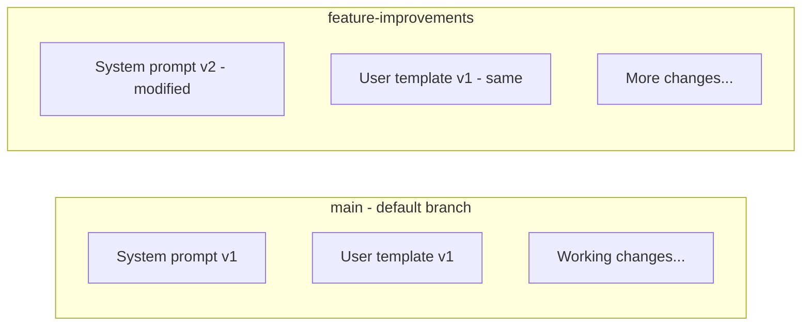
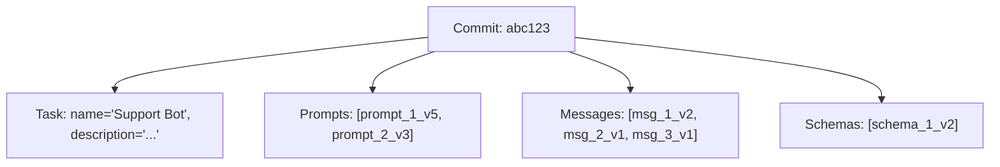
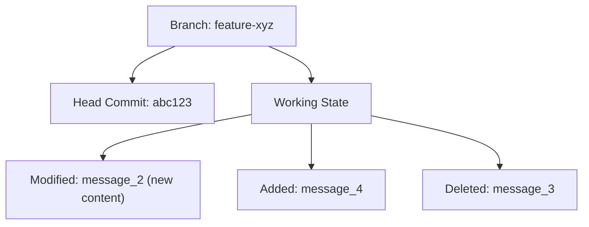
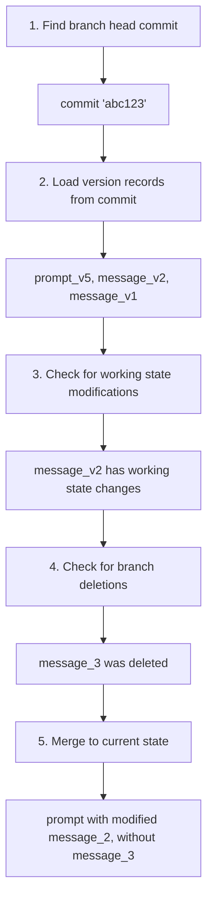

Moxn implements a Git-inspired versioning system. This guide explains how branches, commits, and working state work together.

## Core Concepts

### Branches

A **branch** is an isolated workspace for changes:



**Key properties:**
- Each task has a default branch (usually "main")
- Branches are isolated—changes don't affect other branches
- Create branches for experimentation without risk

### Commits

A **commit** is an immutable snapshot of the entire task state:



**Key properties:**
- Commits are immutable—once created, they never change
- A commit captures ALL entities in the task at that moment
- Use commit IDs for reproducibility

### Working State

**Working state** represents uncommitted changes on a branch:



**Key properties:**
- Working state is mutable
- Only exists per branch
- Gets cleared when you commit

## Access Patterns

### Branch Access

Fetching by branch returns the **latest state** (including uncommitted changes):

```python
# Gets working state + base commit
prompt = await client.get_prompt(
    prompt_id="...",
    branch_name="main"
)
```

**What you get:**
1. Start with the branch's head commit
2. Overlay any working state modifications
3. Apply any deletions
4. Return the merged "current state"

**Use for:** Development, testing, rapid iteration

### Commit Access

Fetching by commit returns an **immutable snapshot**:

```python
# Gets exact state at commit time
prompt = await client.get_prompt(
    prompt_id="...",
    commit_id="abc123def456"
)
```

**What you get:**
- The exact prompt state when that commit was created
- Guaranteed to never change
- Cached indefinitely by the SDK

**Use for:** Production, reproducibility, auditing

### Branch Head Access

To get the latest **committed** state (without working changes):

```python
# Step 1: Get the branch head
head = await client.get_branch_head(
    task_id="task-uuid",
    branch_name="main"
)

# Step 2: Fetch by that commit
prompt = await client.get_prompt(
    prompt_id="...",
    commit_id=head.effectiveCommitId
)
```

**What you get:**
- The most recent committed state
- No work-in-progress changes
- Still immutable

**Use for:** Deploying "stable" versions, CI/CD

## Resolution Logic

When you fetch by branch, here's what happens:



This resolution happens server-side. The SDK receives the resolved state.

## Production Deployment Patterns

### Pattern 1: Pin to Commit

The safest approach—pin production to a specific commit:

```python
# In your config or environment
PROMPT_COMMIT_ID = "abc123def456"

# In your code
session = await client.create_prompt_session(
    prompt_id="...",
    commit_id=PROMPT_COMMIT_ID
)
```

**Pros:**
- Completely immutable
- Perfect reproducibility
- Safe from accidental changes

**Cons:**
- Manual updates required
- Need to track commit IDs

### Pattern 2: Latest Commit on Branch

Use the branch head, but only committed state:

```python
# Get latest committed state
head = await client.get_branch_head("task-id", "production")
session = await client.create_prompt_session(
    prompt_id="...",
    commit_id=head.effectiveCommitId
)
```

**Pros:**
- Automatically gets new commits
- No work-in-progress changes
- Can use a "production" branch for controlled releases

**Cons:**
- Any commit to the branch goes live
- Need branch discipline

### Pattern 3: Branch Access (Development Only)

For development and testing:

```python
session = await client.create_prompt_session(
    prompt_id="...",
    branch_name="main"
)
```

**Pros:**
- Always latest, including uncommitted
- Great for rapid iteration

**Cons:**
- Can change unexpectedly
- Not suitable for production

## Caching Behavior

The SDK caches based on access pattern:

| Access | Cached | Reason |
|--------|--------|--------|
| `commit_id="..."` | Yes | Commits are immutable |
| `branch_name="..."` | No | Branches change |

```python
# First call: fetches from API
prompt1 = await client.get_prompt("...", commit_id="abc123")

# Second call: returns from cache
prompt2 = await client.get_prompt("...", commit_id="abc123")

# Always fetches: branch could have changed
prompt3 = await client.get_prompt("...", branch_name="main")
```

## Branch Response Fields

When fetching a branch head:

```python
head = await client.get_branch_head("task-id", "main")

head.branchId              # UUID
head.branchName            # str
head.taskId                # UUID
head.headCommitId          # str | None - latest commit on this branch
head.parentCommitId        # str | None - where branch forked from
head.effectiveCommitId     # str - what to use (head or parent if no commits)
head.hasUncommittedChanges # bool - is there working state?
head.lastCommittedAt       # datetime | None
head.isDefault             # bool - is this the default branch?
```

## Entity Version Context

Fetched entities include version context:

```python
prompt = await client.get_prompt("...", branch_name="main")

prompt.branch_id   # UUID | None - if fetched by branch
prompt.commit_id   # UUID | None - if fetched by commit
```

This helps with:
- Knowing which version you're working with
- Including version info in telemetry
- Debugging version-related issues

## Immutability Guarantees

### What's Immutable

- **Commits**: Once created, never change
- **Version records**: The state captured in a commit
- **Content records**: Message and property content is content-addressed

### What's Mutable

- **Working state**: Changes until committed
- **Branch pointers**: Head moves with new commits
- **Deletions**: Tracked per-branch

## Best Practices

<AccordionGroup>
  <Accordion title="Use commit IDs in production">
    Always pin production deployments to specific commit IDs for reproducibility.
  </Accordion>
  <Accordion title="Create feature branches for experiments">
    Don't experiment on main. Create branches to test changes safely.
  </Accordion>
  <Accordion title="Commit early and often">
    Commits are cheap and create restore points.
  </Accordion>
  <Accordion title="Use branch names in development">
    During development, use branch access for rapid iteration.
  </Accordion>
  <Accordion title="Consider a production branch">
    Use a dedicated "production" branch that only gets stable commits.
  </Accordion>
</AccordionGroup>

## Next Steps

<CardGroup cols={2}>
  <Card title="Entity Model" icon="diagram-project" href="/concepts/entities">
    Understand the data model
  </Card>
  <Card title="Working with Prompts" icon="file-lines" href="/guides/prompts">
    Fetch prompts by branch or commit
  </Card>
  <Card title="Web App: Versioning" icon="browser" href="/webapp/versioning">
    Manage branches in the web app
  </Card>
  <Card title="Telemetry" icon="chart-line" href="/telemetry/spans">
    Track which versions are used
  </Card>
</CardGroup>
