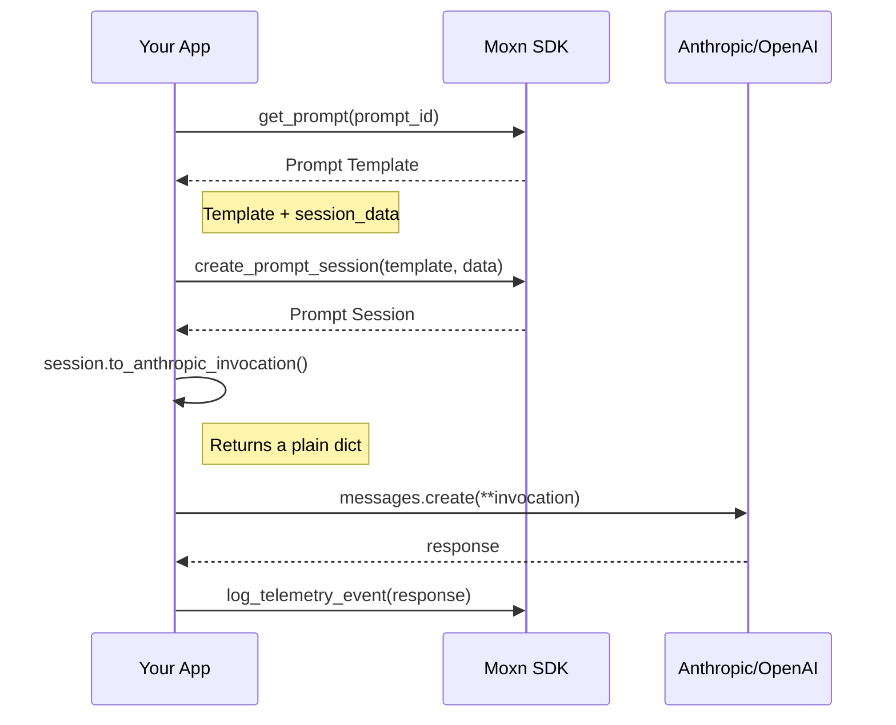

# Why Moxn?

Prompts are code, but they don't have the tooling.

When building AI applications, you face a familiar set of challenges:

- **No dedicated tooling**: Prompts are scattered across strings, YAML files, and spreadsheets—with no proper editor for structured content
- **Version control friction**: Prompts either live in git (coupled to deploys, painful for domain experts) or in config systems (schemaless, painful for engineers)
- **No type safety**: Input variables are _stringly_-typed, leading to runtime errors
- **No observability**: You can't see what prompts actually ran in production
- **No reuse**: Want a shared system message across multiple agent surfaces? Good luck
- **No collaboration**: No shared workflows for reviewing prompts or debugging production traces

Moxn solves these problems by treating prompts as first-class versioned entities with type-safe interfaces and full observability.

## Core Architecture

Moxn separates **content management** from **runtime execution**:

<Steps>
  <Step title="Prompt Template" icon="file-lines">
    Messages, variables, and model config—stored in Moxn, versioned like code.
  </Step>
  <Step title="Prompt Session" icon="layer-group">
    Template + your runtime data, created in your application.
  </Step>
  <Step title="Invocation" icon="paper-plane">
    A plain Python dict you pass directly to the provider SDK.
  </Step>
</Steps>



## Design Philosophy

### Moxn Builds Payloads, You Own the Integration

The SDK produces standard Python dictionaries. You unpack them directly into provider SDKs:

```python
# Moxn builds the payload from your template + data
invocation = session.to_anthropic_invocation()

# You call the provider directly—no wrapper, no magic
response = anthropic.messages.create(**invocation)
```

This means you can always:
- **Modify the payload** before sending (add headers, override settings)
- **Use new provider features** without waiting for SDK updates
- **Compose with other tools** in your stack

Moxn simplifies the common path without making edge cases harder.

## Key Features

<CardGroup cols={2}>
  <Card title="Rich Prompt Editor" icon="pen-fancy">
    A block-based editor with mermaid diagrams, code blocks, XML documents, and
    multimodal content. Author prompts and review traces in the same interface.
  </Card>
  <Card title="Git-Like Versioning" icon="code-branch">
    Branch, commit, and rollback prompts. Pin production to specific commits.
    Review diffs before deploying.
  </Card>
  <Card title="Type-Safe Interfaces" icon="shield-check">
    Auto-generated Pydantic models ensure type safety from editor to runtime.
    Get autocomplete and validation.
  </Card>
  <Card title="Full Observability" icon="chart-line">
    View traces and spans in the same rich editor. W3C Trace Context compatible
    with complete LLM event logging.
  </Card>
</CardGroup>

<Frame caption="The Moxn editor with structured content blocks">
  
</Frame>

## Next Steps

<CardGroup cols={2}>
  <Card title="Quick Start" icon="rocket" href="/quickstart">
    Install and run your first prompt
  </Card>
  <Card title="The Moxn Workflow" icon="arrows-rotate" href="/guides/workflow">
    See the complete development cycle
  </Card>
</CardGroup>
