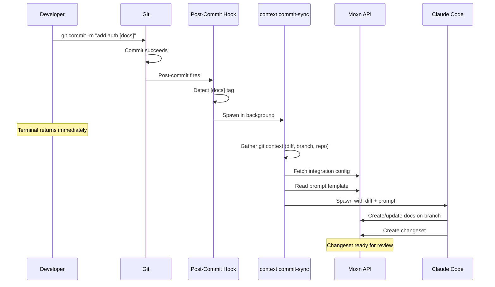

The commit workflow runs **locally on your machine** as a post-commit hook. When you include `[docs]` in your commit message, the hook detects the tag and spawns Claude Code in the background to review the diff and update your Knowledge Base.

The commit succeeds immediately — Claude runs in a detached background process and creates a changeset for you to review later.

## Prerequisites

- `@moxn/context-cli` installed globally (`npm install -g @moxn/context-cli`)
- [Husky](https://typicode.github.io/husky/) set up in your project (or any git hooks manager)
- A Moxn API key set in your environment or `.env.local`
- An [Anthropic API key](https://console.anthropic.com/) (`ANTHROPIC_API_KEY` env var)
- An integration configured in Moxn for your repository

## Setup

### 1. Install the CLI

```bash
npm install -g @moxn/context-cli
```

### 2. Set Your API Key

Add your Moxn API key to `.env.local` in your project root:

```bash .env.local
MOXN_API_KEY=your-api-key
MOXN_BASE_URL=https://moxn.dev
```

The CLI loads `.env.local` automatically. You can also set `MOXN_API_KEY` as a shell environment variable.

<Note>
The priority order is: `--api-key` flag > environment variable > `.env.local` > `.env`. Use `.env.local` for local dev — it's gitignored and machine-specific.
</Note>

### 3. Add the Post-Commit Hook

Create `.husky/post-commit` in your project:

```bash .husky/post-commit
# Moxn: auto-update KB docs on commits tagged with [docs]
COMMIT_MSG=$(git log -1 --pretty=%B)

if echo "$COMMIT_MSG" | grep -q '\[docs\]'; then
  if command -v context >/dev/null 2>&1; then
    echo "[moxn] [docs] tag detected — running commit-sync in background..."
    context commit-sync --background &
  else
    echo "[moxn] [docs] tag detected but 'context' CLI not found. Install: npm i -g @moxn/context-cli"
  fi
fi
```

Make it executable:

```bash
chmod +x .husky/post-commit
```

<Tip>
If you're not using Husky, add the same script to `.git/hooks/post-commit` directly. The logic is the same — it just won't be version-controlled.
</Tip>

## Usage

Add `[docs]` anywhere in your commit message to trigger auto-docs:

```bash
git commit -m "add rate limiting to auth endpoints [docs]"
```

You'll see:

```
[moxn] [docs] tag detected — running commit-sync in background...
```

Your terminal returns immediately. Claude runs in the background and writes output to a log file at `/tmp/moxn-commit-sync-<hash>-<timestamp>.log`.

### Commits Without `[docs]`

Regular commits are unaffected — the hook exits instantly with zero overhead:

```bash
git commit -m "fix typo in readme"
# No output from the hook, no delay
```

### Skipping the Hook

Standard git mechanisms work:

```bash
# Skip all hooks (pre-commit lint + post-commit docs)
git commit --no-verify -m "wip [docs]"

# Skip Husky hooks only
HUSKY=0 git commit -m "wip [docs]"
```

## How It Works



## Branch Strategy

The commit workflow maps git branches to KB branches:

| Git branch | KB branch | Changeset target | Rationale |
|------------|-----------|-------------------|-----------|
| `main` or `master` | `staging` | `main` | Docs go to a staging area since main has no PR to merge from |
| `feature/auth` | `feature/auth` | `main` | Mirrors the git branch, just like the PR workflow |
| `fix/rate-limit` | `fix/rate-limit` | `main` | Same — branch names match 1:1 |

<Note>
When you're on `main`, docs are created on a `staging` KB branch. This gives you a review step before they land on `main` in the KB. Merge the changeset when you're satisfied.
</Note>

## CLI Reference

You can also run `commit-sync` directly without the hook:

```bash
# Foreground — see Claude's output in real time
context commit-sync

# Background — detached process, returns immediately
context commit-sync --background

# Preview the prompts without running Claude
context commit-sync --dry-run

# Override auto-detected repo
context commit-sync --repo your-org/your-repo
```

| Flag | Default | Description |
|------|---------|-------------|
| `--background` | `false` | Run Claude in a detached process. Logs to `/tmp/moxn-commit-sync-<hash>-<ts>.log` |
| `--dry-run` | `false` | Print system and user prompts, do not run Claude |
| `--repo` | auto-detected | Override the repository name (parsed from `git remote`) |
| `--max-turns` | `50` | Maximum Claude Code turns |
| `--model` | default | Claude model to use (e.g., `sonnet`, `opus`) |

## Reviewing Changes

After the background process completes, find the changeset in your KB:

1. Go to **Knowledge Base > Changesets** in the Moxn web app
2. Find the changeset titled "Docs: commit \{hash\}"
3. Review the documents and their content on the branch
4. Click **Merge All** to land the docs on main

<Tip>
Run `context commit-sync --dry-run` first to see what prompts Claude would receive. This is useful for tuning your integration's prompt template.
</Tip>
