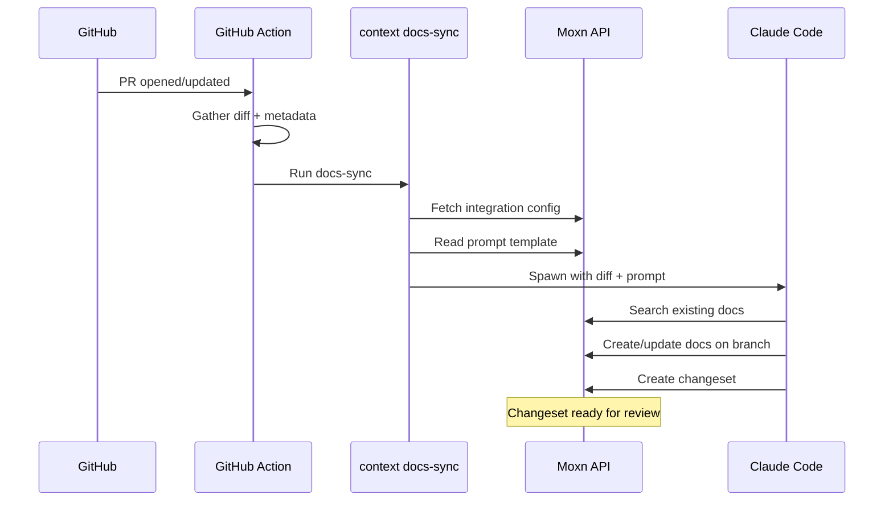

The PR workflow runs as a **GitHub Action** on your repository. When a pull request is opened, updated, or reopened, the action gathers the diff, fetches your integration config from Moxn, and spawns Claude Code to create or update documentation in your Knowledge Base.

All processing happens on your **GitHub Actions runner** — your code never leaves GitHub's infrastructure.

## Prerequisites

- A GitHub repository
- A [Moxn API key](https://moxn.dev) with read/write access
- An [Anthropic API key](https://console.anthropic.com/) for Claude
- An integration configured in Moxn for your repository

## Setup

### 1. Configure the Integration

In the Moxn web app, go to **Settings > Integrations > GitHub** and create an integration:

- **Repository**: Your repo (e.g., `your-org/your-repo`)
- **Trigger mode**: Choose when docs should be generated (see [Trigger Modes](#trigger-modes))
- **Target database**: Which KB database to add new docs to
- **Prompt template**: Customize or use the auto-generated default

### 2. Add the Workflow File

Copy this workflow to `.github/workflows/moxn-docs.yml` in your repository:

```yaml .github/workflows/moxn-docs.yml
name: Moxn Docs Sync

on:
  pull_request:
    types: [opened, synchronize, reopened]

permissions:
  contents: read
  pull-requests: read

jobs:
  sync-docs:
    runs-on: ubuntu-latest
    if: github.event.pull_request.head.repo.full_name == github.repository

    steps:
      - name: Checkout repository
        uses: actions/checkout@v4

      - name: Set up Node.js
        uses: actions/setup-node@v4
        with:
          node-version: '20'

      - name: Install tools
        run: |
          npm install -g @anthropic-ai/claude-code
          npm install -g @moxn/context-cli

      - name: Gather PR context
        run: |
          gh pr diff ${{ github.event.pull_request.number }} > /tmp/pr-diff.patch
          gh pr view ${{ github.event.pull_request.number }} \
            --json title,body,labels,files,baseRefName,headRefName \
            > /tmp/pr-metadata.json
        env:
          GH_TOKEN: ${{ github.token }}

      - name: Sync documentation
        run: |
          context docs-sync \
            --pr-number ${{ github.event.pull_request.number }} \
            --repo ${{ github.repository }} \
            --diff-file /tmp/pr-diff.patch \
            --pr-metadata-file /tmp/pr-metadata.json \
            --pr-url ${{ github.event.pull_request.html_url }} \
            --head-sha ${{ github.event.pull_request.head.sha }}
        env:
          MOXN_API_KEY: ${{ secrets.MOXN_API_KEY }}
          ANTHROPIC_API_KEY: ${{ secrets.ANTHROPIC_API_KEY }}
```

### 3. Add Repository Secrets

In your GitHub repository settings, go to **Settings > Secrets and variables > Actions** and add:

| Secret | Value |
|--------|-------|
| `MOXN_API_KEY` | Your Moxn API key |
| `ANTHROPIC_API_KEY` | Your Anthropic API key |

<Note>
The workflow has **read-only** repository permissions. It never pushes commits, modifies files, or writes to your repo. All documentation changes happen in Moxn's Knowledge Base via the API.
</Note>

## How It Works



1. A PR event triggers the GitHub Action
2. The action gathers the PR diff and metadata (title, body, labels, changed files)
3. `context docs-sync` fetches your integration config and prompt template from Moxn
4. Claude Code is spawned with the diff and your prompt template as instructions
5. Claude searches for existing docs, decides what to document, and creates or updates KB documents **on a branch matching the PR branch name**
6. A **changeset** is created grouping all document changes for review

## Trigger Modes

Control when docs are generated based on properties of the PR:

| Mode | Behavior | Example |
|------|----------|---------|
| `always` | Runs on every PR | Good for small repos or docs-heavy teams |
| `path_match` | Only when changed files match patterns | `src/api/**`, `lib/auth/*` |
| `label` | Only when the PR has specific labels | `docs`, `documentation` |
| `keyword` | Only when the PR title or body contains a keyword | `[docs]`, `needs-docs` |

<Tip>
Start with `always` to see how it works, then switch to `path_match` or `label` once you know which changes warrant documentation.
</Tip>

## Branch Strategy

The PR workflow creates KB branches that **match the PR branch name**:

| Git branch | KB branch | Changeset target |
|------------|-----------|------------------|
| `feature/auth` | `feature/auth` | `main` |
| `fix/rate-limit` | `fix/rate-limit` | `main` |

When the changeset is merged in Moxn, the documentation lands on `main` in your KB — mirroring the PR merge in Git.

## Reviewing Changes

After the action runs, you'll find a new changeset in your KB:

1. Go to **Knowledge Base > Changesets** in the Moxn web app
2. Find the changeset titled "Docs: MR #\{number\}"
3. Click into it to see which documents were created or updated
4. Click **Doc** to view the content on the feature branch
5. When satisfied, click **Merge All** to land the docs on main

## CLI Reference

The `docs-sync` command is typically called by the GitHub Action, but you can run it manually for testing:

```bash
context docs-sync \
  --pr-number 42 \
  --repo your-org/your-repo \
  --diff-file /path/to/diff.patch \
  --pr-metadata-file /path/to/metadata.json \
  --pr-url https://github.com/your-org/your-repo/pull/42 \
  --dry-run  # Preview without running Claude
```

| Flag | Required | Description |
|------|----------|-------------|
| `--pr-number` | Yes | PR number |
| `--repo` | Yes | Repository full name (`org/repo`) |
| `--diff-file` | Yes | Path to the diff file |
| `--pr-metadata-file` | Yes | Path to PR metadata JSON |
| `--pr-url` | Yes | URL to the PR |
| `--head-sha` | No | Head commit SHA |
| `--max-turns` | No | Max Claude Code turns (default: 50) |
| `--model` | No | Claude model (e.g., `sonnet`, `opus`) |
| `--dry-run` | No | Show prompts without running Claude |
