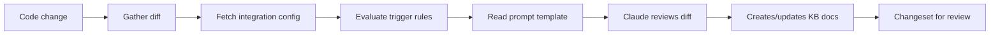

Auto-Docs connects your development workflow to your Moxn Knowledge Base. When code changes — through a pull request or a local commit — an AI agent reviews the diff and creates or updates documentation automatically.

Changes land on a branch in your KB as a **changeset** that you review and merge, just like a code PR.

## Two Modes

| | PR Workflow | Commit Workflow |
|---|---|---|
| **Trigger** | GitHub Action on PR open/update | Post-commit hook with `[docs]` tag |
| **Runs where** | GitHub Actions runner (CI) | Your local machine |
| **Best for** | Team-wide docs on every PR | Individual devs documenting as they go |
| **Branch strategy** | KB branch matches PR branch name | `main` → `staging`, feature branch → same name |
| **Blocking** | No — runs async in CI | No — spawns Claude in background |

## How It Works

Both modes follow the same core flow:

1. A code change happens (PR opened or commit made)
2. The diff and changed file list are collected
3. Your **integration config** is fetched from Moxn — this tells the system which database to target, which trigger rules to apply, and which prompt template to use
4. **Trigger rules** are evaluated (always run, match file paths, match labels, or match keywords)
5. A **prompt template** (a Moxn document you can edit) tells Claude how to write docs for your project
6. Claude Code reviews the diff using your prompt template and creates or updates KB documents on a branch
7. A **changeset** groups the changes for review and merge

## Prerequisites

- A [Moxn account](https://moxn.dev) with an API key (**Settings > API Keys**)
- The `@moxn/context-cli` installed (`npm install -g @moxn/context-cli`)
- An integration configured for your repository (**Settings > Integrations**)

<Note>
The integration config — trigger rules, prompt template, target database — is managed in the Moxn web app. Both the PR and commit workflows read this config at runtime, so you configure once and both modes use it.
</Note>

## Integration Config

Each integration specifies:

| Setting | Description |
|---------|-------------|
| **Repository pattern** | Which repo this applies to (e.g., `org/repo` or `org/*`) |
| **Trigger mode** | `always`, `path_match`, `label`, or `keyword` |
| **Prompt template** | A KB document containing instructions for the AI |
| **Target database** | Which KB database new docs are added to |
| **Target path** | Path prefix for new documents (e.g., `/engineering/auto-docs`) |

## Prompt Templates

The prompt template is a regular Moxn document that you edit in the web app. It controls how the AI writes documentation for your project — what to focus on, what to skip, style guidelines, etc.

When you create an integration, a default template is generated. Customize it to match your team's documentation standards.

<Tip>
Good prompt templates are specific. Instead of "document all changes", try "focus on API changes and new features. Use the existing architecture doc at `/engineering/architecture` as context. Skip test-only changes."
</Tip>

## Next Steps

<CardGroup cols={2}>
  <Card title="PR Workflow" icon="code-pull-request" href="/guides/auto-docs-pr">
    Set up a GitHub Action to auto-generate docs on every pull request
  </Card>
  <Card title="Commit Workflow" icon="terminal" href="/guides/auto-docs-commit">
    Add a post-commit hook to generate docs from local commits
  </Card>
</CardGroup>
