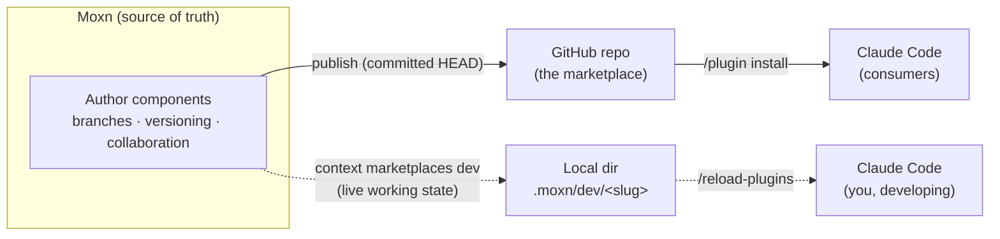

Moxn is a **source of truth for AI coding-agent plugins**. You author your skills, commands, and agents in Moxn — with the same branches, versioning, and collaboration you get for documents — then publish them to GitHub as an installable plugin marketplace. A local **dev loop** lets you iterate against your Moxn content in seconds, without publishing.

<Note>
One published repo installs in **all three harnesses**: **Claude Code** (skills, commands, and agents — verified end-to-end), **Codex** (skills — see [Installing in Codex](/guides/marketplaces/publishing#installing-in-codex)), and **Cursor** (skills and agents — see [Installing in Cursor](/guides/marketplaces/publishing#installing-in-cursor)). The authoring and dev-loop flows below are written for Claude Code.
</Note>

## The mental model

Three concepts, nested:

- **Marketplace** — a git-versioned Moxn workspace that holds one or more plugins. It maps to a single GitHub repository when you publish.
- **Plugin** — a bundle of components that a user installs as one unit (e.g. a `localization` plugin).
- **Component** — a single skill, command, or agent inside a plugin. Each is a Moxn document with a small frontmatter contract.

| Component | What it is | Frontmatter |
| --- | --- | --- |
| **skill** | A `SKILL.md` — instructions an agent loads on demand | `name`, `description` (both required), `allowed-tools?` |
| **command** | A slash command (`/plugin:name`) | `description?`, `argument-hint?`, `allowed-tools?` — the name is the filename |
| **agent** | A subagent definition | `name`, `description` (both required), `tools?`, `model?` |

## Two planes: publish vs. develop

The thing to internalize is that Moxn drives **two separate paths**, and they never touch each other:

- **The publish plane (solid)** is how content reaches *users*. You **publish** a marketplace, which projects its **committed HEAD** into the GitHub repo, one-way. Consumers `/plugin install` from that repo. This is a deliberate release step.
- **The dev plane (dotted)** is how *you* iterate. `context marketplaces dev` pulls a marketplace's **live branch content straight from Moxn** into a local directory — **no GitHub, no publish involved** — and wires it into Claude Code, Codex or Cursor. This is the fast loop, covered in [The dev loop](/guides/marketplaces/dev-loop).

<Note>
Publish serves **committed** HEAD; the dev loop serves **live working state** (even uncommitted edits on the branch). That difference is intentional — publishing is a release, developing is a preview.
</Note>

## Where everything lives

| Thing | Lives in | Notes |
| --- | --- | --- |
| Your authored components | **Moxn** | Git-versioned; edit on `main` or a feature branch |
| The published plugin | **GitHub** | One repo per marketplace; only what you explicitly `publish` |
| Your local dev copy | **Your machine** (`./.moxn/dev/<marketplace-slug>`) | Materialized by `marketplaces dev`; never published |
| The installed plugin | **`~/.claude/plugins`** | What consumers run; pinned to a published commit |

## The lifecycle at a glance

<Steps>
  <Step title="Author">
    Create a marketplace, add a plugin, and write your skills / commands / agents in Moxn. See [Create & author](/guides/marketplaces/authoring).
  </Step>
  <Step title="Develop">
    Iterate with the local dev loop — edit in Moxn, re-run `marketplaces dev`, `/reload-plugins`, test in your agent. See [The dev loop](/guides/marketplaces/dev-loop).
  </Step>
  <Step title="Publish">
    Connect a GitHub repo and publish your committed content to it. See [Publish & install](/guides/marketplaces/publishing).
  </Step>
  <Step title="Install">
    You (and your users) `/plugin marketplace add` the repo and `/plugin install` the plugin. See [Publish & install](/guides/marketplaces/publishing).
  </Step>
</Steps>

## Prerequisites

- The **context CLI** installed and authenticated — see [CLI Quick Start](/guides/context-cli).
- A Moxn account with a marketplace (or the ability to create one).
- **Claude Code** for installing and running plugins.
