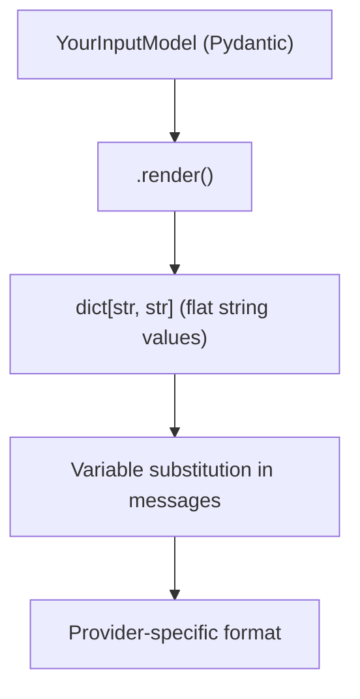

A `PromptSession` is the runtime representation of a prompt combined with your input data. It handles variable substitution, provider conversion, and response parsing.

## Creating Sessions

### From prompt ID

The simplest way to create a session:

```python
async with MoxnClient() as client:
    session = await client.create_prompt_session(
        prompt_id="your-prompt-id",
        branch_name="main",
        session_data=YourInputModel(
            query="How do I reset my password?",
            user_id="user_123"
        )
    )
```

This fetches the prompt and creates a session in one call.

### From session data with metadata

If your codegen'd model has `moxn_schema_metadata`, you can create a session from just the data:

```python
from generated_models import ProductHelpInput

session_data = ProductHelpInput(
    query="How do I reset my password?",
    user_id="user_123"
)

# Session data knows its prompt ID from metadata
session = await client.prompt_session_from_session_data(
    session_data=session_data,
    branch_name="main"
)
```

### From a PromptTemplate directly

For more control, create sessions manually:

```python
from moxn.models.prompt import PromptSession

prompt = await client.get_prompt("...", branch_name="main")

session = PromptSession.from_prompt_template(
    prompt=prompt,
    session_data=YourInputModel(...)
)
```

## Session Data and Rendering

### The render() flow

Session data goes through a transformation pipeline:



### How render() works

The `render()` method transforms your typed data into a flat dictionary of strings:

```python
class ProductHelpInput(RenderableModel):
    query: str
    user_id: str
    documents: list[Document]

    def render(self, **kwargs) -> dict[str, str]:
        return {
            "query": self.query,
            "user_id": self.user_id,
            "documents": json.dumps([d.model_dump() for d in self.documents])
        }
```

Each key in the returned dict corresponds to a variable name in your prompt messages.

### Customizing render()

You can customize how data is formatted for the LLM:

```python
class ProductHelpInput(RenderableModel):
    documents: list[Document]

    def render(self, **kwargs) -> dict[str, str]:
        # Format as markdown
        formatted = "\n".join([
            f"## {doc.title}\n{doc.content}"
            for doc in self.documents
        ])
        return {
            "documents": formatted
        }
```

Or use XML formatting:

```python
def render(self, **kwargs) -> dict[str, str]:
    docs_xml = "\n".join([
        f"<document id='{doc.id}'>\n{doc.content}\n</document>"
        for doc in self.documents
    ])
    return {
        "documents": f"<documents>\n{docs_xml}\n</documents>"
    }
```

## Converting to Provider Format

Sessions convert to provider-specific formats using the `to_*_invocation()` methods:

### Anthropic

```python
from anthropic import Anthropic

anthropic = Anthropic()
response = anthropic.messages.create(
    **session.to_anthropic_invocation()
)
```

The invocation includes:
- `system`: System message (if present)
- `messages`: User/assistant messages
- `model`: From prompt's completion_config
- `max_tokens`: From completion_config
- `tools`: If tools are configured
- `output_format`: If structured output is configured

### OpenAI

```python
from openai import OpenAI

openai = OpenAI()
response = openai.chat.completions.create(
    **session.to_openai_chat_invocation()
)
```

### Google

```python
from google import genai

client = genai.Client()
response = client.models.generate_content(
    **session.to_google_gemini_invocation()
)
```

### Generic method

Use `to_invocation()` with an explicit provider:

```python
from moxn_types.content import Provider

# Uses completion_config.provider if set
payload = session.to_invocation()

# Or specify explicitly
payload = session.to_invocation(provider=Provider.ANTHROPIC)
```

### Overriding parameters

Override model parameters at runtime:

```python
response = anthropic.messages.create(
    **session.to_anthropic_invocation(
        model="claude-sonnet-4-20250514",  # Override model
        max_tokens=4096,                    # Override max tokens
        temperature=0.7                     # Override temperature
    )
)
```

## Adding Runtime Messages

Append messages to a session after creation:

### Add user message

```python
session.append_user_text(
    text="Here's additional context...",
    name="Additional Context"
)
```

### Add assistant message

```python
session.append_assistant_text(
    text="I understand. Let me help with that.",
    name="Assistant Acknowledgment"
)
```

### Add from LLM response

After getting a response, add it to the session for multi-turn conversations:

```python
# Parse the response
parsed = session.parse_provider_response(response, Provider.ANTHROPIC)

# Add to session
session.append_assistant_response(
    parsed_response=parsed,
    name="Assistant Response"
)

# Now add a follow-up user message
session.append_user_text("Can you elaborate on that?")

# Send again
response2 = anthropic.messages.create(
    **session.to_anthropic_invocation()
)
```

## Response Parsing

Parse provider responses into a normalized format:

```python
from moxn_types.content import Provider

# Get raw response from provider
response = anthropic.messages.create(...)

# Parse to normalized format
parsed = session.parse_provider_response(response, Provider.ANTHROPIC)

# Access normalized content
for candidate in parsed.candidates:
    for block in candidate.content:
        if block.block_type == "text":
            print(block.text)
        elif block.block_type == "tool_call":
            print(f"Tool: {block.tool_name}({block.input})")

# Access metadata
print(f"Tokens: {parsed.input_tokens} in, {parsed.output_tokens} out")
print(f"Model: {parsed.model}")
print(f"Stop reason: {parsed.stop_reason}")
```

## Creating Telemetry Events

Create LLM events from responses for logging:

```python
# Method 1: From raw response
llm_event = session.create_llm_event_from_response(
    response=response,
    provider=Provider.ANTHROPIC
)

# Method 2: From parsed response (with more control)
parsed = session.parse_provider_response(response, Provider.ANTHROPIC)
llm_event = session.create_llm_event_from_parsed_response(
    parsed_response=parsed,
    request_config=request_config,  # Optional
    schema_definition=schema,       # Optional
    attributes={"custom": "data"},  # Optional
    validation_errors=errors        # Optional
)

# Log it
async with client.span(session) as span:
    await client.log_telemetry_event(llm_event)
```

## Session Properties

Access session information:

```python
session.id           # UUID - unique session identifier
session.prompt_id    # UUID - source prompt ID
session.prompt       # PromptTemplate - the underlying prompt
session.messages     # list[Message] - current messages (with appended)
session.session_data # RenderableModel | None - your input data
```

## Complete Example

Here's a full multi-turn conversation example:

```python
from moxn import MoxnClient
from moxn_types.content import Provider
from anthropic import Anthropic
from generated_models import ChatInput

async def chat_conversation():
    async with MoxnClient() as client:
        # Create initial session
        session = await client.create_prompt_session(
            prompt_id="chat-prompt-id",
            branch_name="main",
            session_data=ChatInput(
                user_name="Alice",
                system_context="You are a helpful assistant."
            )
        )

        anthropic = Anthropic()

        # First turn
        session.append_user_text("What's the weather like today?")

        async with client.span(session, name="turn_1") as span:
            response1 = anthropic.messages.create(
                **session.to_anthropic_invocation()
            )
            await client.log_telemetry_event_from_response(
                session, response1, Provider.ANTHROPIC
            )

        # Add response to session
        parsed1 = session.parse_provider_response(response1, Provider.ANTHROPIC)
        session.append_assistant_response(parsed1)

        # Second turn
        session.append_user_text("What about tomorrow?")

        async with client.span(session, name="turn_2") as span:
            response2 = anthropic.messages.create(
                **session.to_anthropic_invocation()
            )
            await client.log_telemetry_event_from_response(
                session, response2, Provider.ANTHROPIC
            )

        return response2.content[0].text
```

## Next Steps

<CardGroup cols={2}>
  <Card title="Provider Integration" icon="plug" href="/guides/providers">
    Deep dive into provider-specific handling
  </Card>
  <Card title="Code Generation" icon="wand-magic-sparkles" href="/guides/codegen">
    Generate type-safe session data models
  </Card>
  <Card title="Spans & Tracing" icon="timeline" href="/telemetry/spans">
    Set up observability for sessions
  </Card>
  <Card title="Variables & Schemas" icon="brackets-curly" href="/concepts/variables">
    Understand how variables work
  </Card>
</CardGroup>
