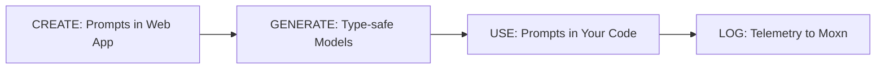

This guide covers the complete development workflow with Moxn—from creating prompts in the web app to deploying type-safe LLM applications with full observability.

## The Development Cycle



## Step 1: Create Prompts in the Web App

### Create a Task

A **Task** is a container for related prompts—think of it like a Git repository. Create one for each distinct AI feature in your application.

<Frame caption="Tasks list in the Moxn dashboard">
  
</Frame>

Tasks contain related prompts, schemas, and traces:

- **Customer Support Bot** (Task)
  - Product Help (Prompt)
  - Query Classification (Prompt)
  - Escalation Handler (Prompt)

<Frame caption="Task detail view showing Prompts, Schemas, and Traces tabs">
  
</Frame>

### Add Messages and Variables

Each prompt contains **messages** with roles (system, user, assistant). Insert **variables** using the `/variable` slash command in the editor, which opens a property editor.

<Frame caption="Message editor with variables displayed as typed blocks">
  
</Frame>

Variables are typed properties—not template strings. When you insert a variable:

1. Type `/variable` in the message editor
2. The **Property Editor** opens where you configure the variable
3. Set the name, type (string, array, object, image-url, etc.), and optional schema reference
4. The variable appears as a styled block in your message

<Frame caption="Property editor for configuring variable types">
  
</Frame>

Variables automatically sync to the prompt's **Input Schema**—the typed interface your code will use:

<Frame caption="Prompt detail showing the Input Schema derived from variables">
  
</Frame>

### Commit Your Changes

When you're happy with your prompts, commit them. This creates an immutable snapshot you can reference by commit ID in production.

## Step 2: Generate Type-Safe Models

Generate Pydantic models from your prompt schemas:

```python
import asyncio
from moxn import MoxnClient

async def generate():
    async with MoxnClient() as client:
        await client.generate_task_models(
            task_id="your-task-id",
            branch_name="main",
            output_dir="./generated_models"
        )

asyncio.run(generate())
```

This creates a Python file with models for each prompt:

```python
# generated_models/customer_support_bot_models.py

class ProductHelpInput(RenderableModel):
    """Input schema for Product Help prompt."""
    company_name: str
    customer_name: str
    query: str
    search_results: list[SearchResult]

    def render(self, **kwargs) -> dict[str, str]:
        return {
            "company_name": self.company_name,
            "customer_name": self.customer_name,
            "query": self.query,
            "search_results": json.dumps([r.model_dump() for r in self.search_results]),
        }
```

<Tip>
  Run codegen as part of your CI/CD pipeline or development workflow, similar to
  database migrations.
</Tip>

## Step 3: Use Prompts in Your Code

Now use the generated models with the SDK:

```python
from moxn import MoxnClient
from moxn_types.content import Provider
from generated_models.customer_support_bot_models import ProductHelpInput
from anthropic import Anthropic

async def handle_support_query(customer_name: str, query: str):
    async with MoxnClient() as client:
        # Create session with type-safe input
        session = await client.create_prompt_session(
            prompt_id="product-help-prompt-id",
            branch_name="main",  # Use commit_id in production
            session_data=ProductHelpInput(
                company_name="Acme Corp",
                customer_name=customer_name,
                query=query,
                search_results=await search_knowledge_base(query)
            )
        )

        # Send to LLM
        anthropic = Anthropic()
        response = anthropic.messages.create(
            **session.to_anthropic_invocation()
        )

        return response.content[0].text
```

### Branch vs Commit Access

| Pattern              | When to Use          | Example            |
| -------------------- | -------------------- | ------------------ |
| `branch_name="main"` | Development, testing | Always gets latest |
| `commit_id="abc123"` | Production           | Immutable, pinned  |

```python
# Development: always get latest
session = await client.create_prompt_session(
    prompt_id="...",
    branch_name="main"
)

# Production: pin to specific commit
session = await client.create_prompt_session(
    prompt_id="...",
    commit_id="abc123def456"
)
```

## Step 4: Log Telemetry

Log every LLM interaction for debugging, analysis, and compliance:

```python
async def handle_support_query(customer_name: str, query: str):
    async with MoxnClient() as client:
        session = await client.create_prompt_session(...)

        # Wrap your LLM call in a span
        async with client.span(session, name="support_response") as span:
            # Add searchable metadata
            span.set_attribute("customer_name", customer_name)
            span.set_attribute("query_type", classify_query(query))

            # Make the LLM call
            response = anthropic.messages.create(
                **session.to_anthropic_invocation()
            )

            # Log the event
            await client.log_telemetry_event_from_response(
                session, response, Provider.ANTHROPIC
            )

        return response.content[0].text
```

### What Gets Logged

Each telemetry event captures:

- **Session data**: The typed input you provided
- **Rendered input**: The flattened string values injected into the prompt
- **Messages**: The complete prompt sent to the LLM
- **Response**: The raw LLM response
- **Metadata**: Span attributes, token counts, latency

## Viewing Results

After logging telemetry, view your traces in the Moxn web app:

1. Navigate to your Task
2. Open the **Traces** tab
3. Filter by time range, prompt, or custom attributes
4. Click a trace to see the full span hierarchy

<Frame caption="Traces list with filtering and search capabilities">
  
</Frame>

You'll see:

- Complete input/output for each LLM call
- Token usage and costs
- Latency breakdowns
- Custom attributes for filtering

## Iterating on Prompts

The workflow creates a tight feedback loop:

1. **Observe**: Review traces to see how prompts perform in production
2. **Branch**: Create a branch for experimentation
3. **Edit**: Modify prompts in the web app
4. **Test**: Use branch access to test changes
5. **Commit**: When satisfied, commit and update production

```python
# Test a branch
session = await client.create_prompt_session(
    prompt_id="...",
    branch_name="experiment-new-tone"  # Your feature branch
)

# Deploy to production
session = await client.create_prompt_session(
    prompt_id="...",
    commit_id="new-commit-id"  # After committing the branch
)
```

## Next Steps

<CardGroup cols={2}>
  <Card title="Working with Prompts" icon="file-lines" href="/guides/prompts">
    Learn the details of fetching and caching prompts
  </Card>
  <Card title="Prompt Sessions" icon="layer-group" href="/guides/sessions">
    Understand sessions and variable rendering
  </Card>
  <Card title="Provider Integration" icon="plug" href="/guides/providers">
    Convert to Anthropic, OpenAI, and Google formats
  </Card>
  <Card
    title="Code Generation"
    icon="wand-magic-sparkles"
    href="/guides/codegen"
  >
    Deep dive into model generation
  </Card>
</CardGroup>
