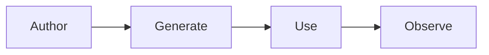

<Steps>
  <Step title="Author prompts in a rich editor">
    Build prompts with typed variables, structured content, and Git-like
    versioning.
  </Step>
  <Step title="Generate type-safe models">
    Run codegen to get Pydantic models with autocomplete and validation for your
    LLM invocations.
  </Step>
  <Step title="Use prompts in your code">
    Fetch prompts, inject your context, get provider specific dialects prepared,
    no more shoe horning.
  </Step>
  <Step title="Observe in production">
    Log traces and review them in the same editor you authored in.
  </Step>
</Steps>

## Quick Example

```python
from moxn import MoxnClient
from anthropic import Anthropic

async with MoxnClient() as client:
    # Fetch prompt and inject your data
    session = await client.create_prompt_session(
        prompt_id="support-agent",
        session_data=SupportInput(query="How do I reset my password?")
    )

    # Send to provider
    response = Anthropic().messages.create(
        **session.to_anthropic_invocation()
    )

    # Log for observability
    await client.log_telemetry_event_from_response(session, response)
```

<CardGroup cols={2}>
  <Card title="Quick Start" icon="rocket" href="/quickstart">
    Install and run your first prompt
  </Card>
  <Card title="Why Moxn?" icon="lightbulb" href="/context">
    The problems we solve
  </Card>
</CardGroup>

<Info>
  **For AI tools:** This documentation is available as [llms.txt](/llms.txt) and [llms-full.txt](/llms-full.txt) for LLM consumption.
</Info>
