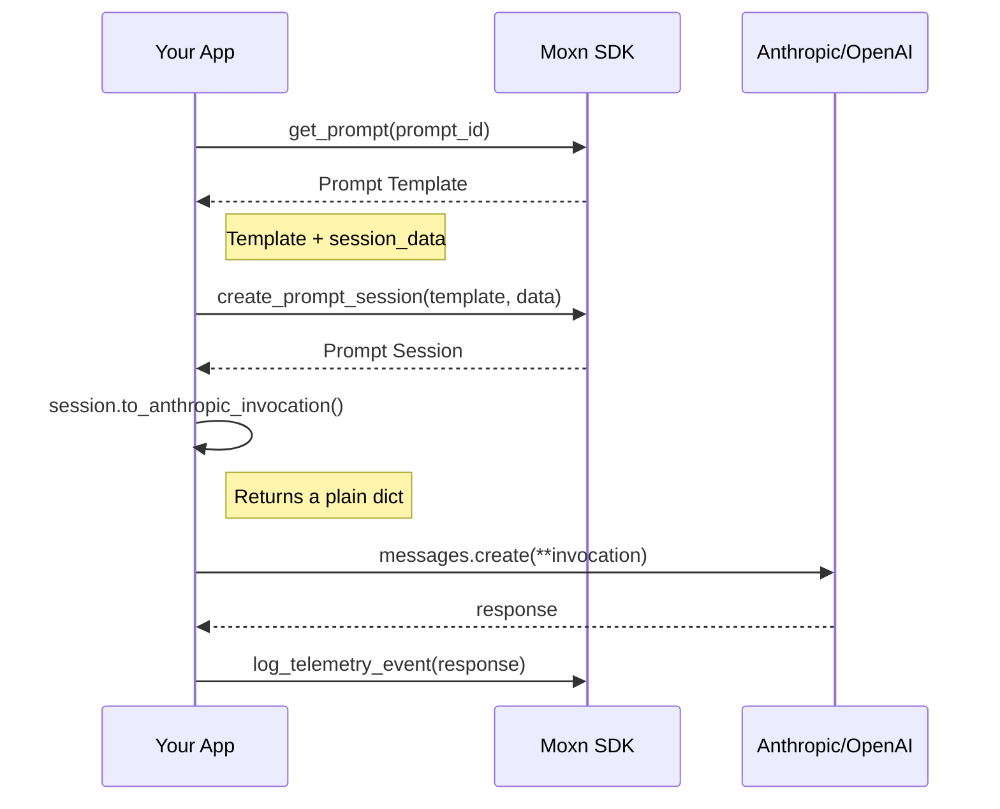

# Moxn SDK

<Frame>
  
</Frame>

Moxn gives AI engineers a rich editing environment for building, versioning, and observing llm applications—with the same productivity tools you expect from modern development workflows.

## The Problem

Prompts are code, but they don't have the tooling.

When building AI applications, you face a familiar set of challenges:

- **No dedicated tooling**: Prompts are scattered across strings, YAML files, and spreadsheets—with no proper editor for structured content
- **version control**: Prompts either
  - live in git and are coupled to your deploy process. Great for your engineers, painful for your domain experts trying to change instructions
  - live in a config sytem. Great for your domain experts, painful for your engineers managing the schemaless integration between context and LLM
- **No type safety**: Input variables are _stringly_-typed, leading to runtime errors
- **No observability**: You can't see what prompts actually ran in production
- **No pass-by-reference**: Using an LLMOps platform and want to maintain a single version of a system message that's shared across multiple surfaces of your agent? good luck
- **No collaboration**: No shared workflows for reviewing prompts or debugging production traces

Moxn solves these problems by treating prompts as first-class versioned entities with type-safe interfaces and full observability.

## Core Concepts

Moxn separates **content management** from **runtime execution**:

<Steps>
  <Step title="Prompt Template" icon="file-lines">
    Messages, variables, and model config—stored in Moxn, versioned like code.
  </Step>
  <Step title="Prompt Session" icon="layer-group">
    Template + your runtime data, created in your application.
  </Step>
  <Step title="Invocation" icon="paper-plane">
    A plain Python dict you pass directly to the provider SDK.
  </Step>
</Steps>



### Moxn Builds Payloads, You Own the Integration

The SDK produces standard Python dictionaries. You unpack them directly into provider SDKs:

```python
# Moxn builds the payload from your template + data
invocation = session.to_anthropic_invocation()

# You call the provider directly—no wrapper, no magic
response = anthropic.messages.create(**invocation)
```

This means you can always:
- **Modify the payload** before sending (add headers, override settings)
- **Use new provider features** without waiting for SDK updates
- **Compose with other tools** in your stack

Moxn simplifies the common path without making edge cases harder.

## How Moxn Works

<Steps>
  <Step title="Author prompts in the rich editor">
    Build prompts with mermaid diagrams, code blocks, XML documents, images, and
    PDFs. Define typed variables that connect to your backend models.
  </Step>
  <Step title="Generate type-safe models">
    Run codegen to create Pydantic models for your prompts. Get runtime validation, autocomplete in your IDE and
    linting.
  </Step>
  <Step title="Use in your code">
    Fetch prompts, create sessions with your data, and send to any LLM provider.
    Or push existing prompts from your codebase to Moxn.
  </Step>
  <Step title="Log telemetry">
    Log LLM calls with full context—input, output, and trace hierarchy. You
    control what gets logged.
  </Step>
</Steps>

<Frame caption="The Moxn editor with structured content blocks">
  
</Frame>

## Key Features

<CardGroup cols={2}>
  <Card title="Rich Prompt Editor" icon="pen-fancy">
    A block-based editor with mermaid diagrams, code blocks, XML documents, and
    multimodal content. Author prompts and review traces in the same interface.
  </Card>
  <Card title="Git-Like Versioning" icon="code-branch">
    Branch, commit, and rollback prompts. Pin production to specific commits.
    Review diffs before deploying.
  </Card>
  <Card title="Type-Safe Interfaces" icon="shield-check">
    Auto-generated Pydantic models ensure type safety from editor to runtime.
    Get autocomplete and validation.
  </Card>
  <Card title="Full Observability" icon="chart-line">
    View traces and spans in the same rich editor. W3C Trace Context compatible
    with complete LLM event logging.
  </Card>
</CardGroup>

## Quick Example

```python
from moxn import MoxnClient
from moxn_types.content import Provider
from anthropic import Anthropic

# Define your session data (YourInputModel can be generated via codegen)
session_data = YourInputModel(
    query="How do I reset my password?",
    user_id="user_123"
)

# Fetch a prompt and create a session
async with MoxnClient() as client:
    session = await client.create_prompt_session(
        prompt_id="your-prompt-id",
        session_data=session_data
    )

    # Convert to Anthropic format and send
    anthropic = Anthropic()
    response = anthropic.messages.create(
        **session.to_anthropic_invocation()
    )

    # Log the interaction
    async with client.span(session) as span:
        await client.log_telemetry_event_from_response(
            session, response, Provider.ANTHROPIC
        )
```

## Next Steps

<CardGroup cols={2}>
  <Card title="Quick Start" icon="rocket" href="/quickstart">
    Get up and running in 5 minutes
  </Card>
  <Card title="The Moxn Workflow" icon="arrows-rotate" href="/guides/workflow">
    Understand the end-to-end workflow
  </Card>
  <Card title="Core Concepts" icon="book" href="/concepts/entities">
    Learn about Tasks, Prompts, and Messages
  </Card>
  <Card title="Examples" icon="code" href="/examples/rag">
    See complete working examples
  </Card>
</CardGroup>
