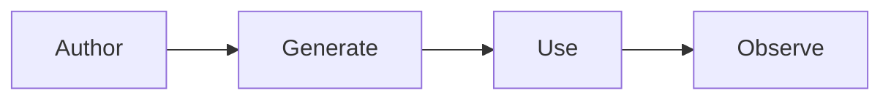

Moxn provides two complementary capabilities for teams building LLM applications: a **Knowledge Base** for AI-native documentation, and **Prompt Management** for versioning and observing your LLM prompts.

---

## Knowledge Base

AI-native documentation with safe write access through branching.

Traditional docs tools force a choice: either AI can edit (risky) or it can't (limiting). The Knowledge Base solves this with Git-like isolation—AI creates and edits on branches, you review and merge.

<Frame>
  
</Frame>

- **Safe AI write access** - AI works on branches, you review and merge to main
- **Works with any MCP host** - Claude, ChatGPT, Cursor, or any MCP-compatible assistant
- **Section-level permissions** - Hide sensitive content from AI while keeping it visible to your team

<Card title="Knowledge Base Guide" icon="book" href="/guides/knowledge-base">
  Set up AI-native documentation with safe write access
</Card>

---

## Prompt Management

Version, render, and observe your LLM prompts.


```mermaid
flowchart LR
    A[Author] --> B[Generate]
    B --> C[Use]
    C --> D[Observe]
```

<Steps>
  <Step title="Author prompts in a rich editor">
    Build prompts with typed variables, structured content, and Git-like versioning.
  </Step>
  <Step title="Generate type-safe models">
    Run codegen to get Pydantic models with autocomplete and validation.
  </Step>
  <Step title="Use prompts in your code">
    Fetch prompts, inject your context, get provider-specific payloads.
  </Step>
  <Step title="Observe in production">
    Log traces and review them in the same editor you authored in.
  </Step>
</Steps>

### Quick Example

```python
from moxn import MoxnClient
from anthropic import Anthropic

async with MoxnClient() as client:
    # Fetch prompt and inject your data
    session = await client.create_prompt_session(
        prompt_id="support-agent",
        session_data=SupportInput(query="How do I reset my password?")
    )

    # Send to provider
    response = Anthropic().messages.create(
        **session.to_anthropic_invocation()
    )

    # Log for observability
    await client.log_telemetry_event_from_response(session, response)
```

<Card title="Prompt Management Guide" icon="code" href="/guides/workflow">
  Start versioning and observing your prompts
</Card>

---

## Next Steps

<CardGroup cols={2}>
  <Card title="Quick Start" icon="rocket" href="/quickstart">
    Install the SDK and run your first prompt
  </Card>
  <Card title="Why Moxn?" icon="lightbulb" href="/context">
    The problems we solve for AI teams
  </Card>
</CardGroup>

<Info>
  **For AI tools:** This documentation is available as [llms.txt](/llms.txt) and [llms-full.txt](/llms-full.txt) for LLM consumption.
</Info>
