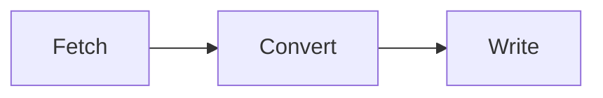

Export your documents to local markdown files. The tool fetches documents via the API, converts sections to markdown, and downloads any attached images, PDFs, and CSVs.

<Tip>
If you have `@moxn/context-cli` installed, you can run `context export-local` instead of `npx @moxn/kb-migrate export`.
</Tip>

## Prerequisites

- Node.js 18+
- A **Moxn API key** with read permissions (create one at **Settings** > **API Keys** in the [web app](https://moxn.dev))

## Quick Start

Export all documents to a local directory:

```bash
npx @moxn/kb-migrate export ./output --api-key=YOUR_API_KEY
```

Preview what would be exported without writing files:

```bash
npx @moxn/kb-migrate export ./output --api-key=YOUR_API_KEY --dry-run
```

Export only documents under a specific path:

```bash
npx @moxn/kb-migrate export ./output --api-key=YOUR_API_KEY --base-path=/engineering
```

<Note>
You can also set `MOXN_API_KEY` as an environment variable instead of passing `--api-key` every time.
</Note>

## How It Works

The export runs in three steps:



### 1. Fetch

The tool calls the Moxn API to list all documents matching your filters (path prefix, date range). For each document, it fetches the full content including sections.

### 2. Convert

Each document's sections are converted to markdown:

| KB Content | Local Result |
|-----------|--------------|
| Section heading | `## Heading` in markdown |
| Rich text | Markdown with formatting (bold, italic, code, links) |
| Code blocks | Fenced code blocks with language |
| Images | Downloaded to `images/` subdirectory, referenced in markdown |
| PDFs | Downloaded to `pdfs/` subdirectory |
| CSVs | Downloaded to `csvs/` subdirectory |
| Mermaid diagrams | Fenced mermaid blocks |

### 3. Write

Files are written to your output directory, mirroring the KB path structure.

## Directory Structure

The exported files mirror your document hierarchy:

```
output/
  engineering/
    api-guide.md
    api-guide/
      setup.md
      authentication.md
    images/
      diagram.png
    pdfs/
      spec.pdf
    csvs/
      metrics.csv
```

Asset directories (`images/`, `pdfs/`, `csvs/`) are created alongside the markdown files as needed. You can customize the directory names with `--image-dir`, `--pdf-dir`, and `--csv-dir`.

## CLI Options

| Option | Default | Description |
|--------|---------|-------------|
| `--api-key <key>` | `$MOXN_API_KEY` | API authentication key (required) |
| `--api-url <url>` | `https://moxn.dev` | API base URL |
| `--base-path <path>` | `/` | Only export documents under this path prefix |
| `--image-dir <name>` | `images` | Directory name for downloaded images |
| `--pdf-dir <name>` | `pdfs` | Directory name for downloaded PDFs |
| `--csv-dir <name>` | `csvs` | Directory name for downloaded CSVs |
| `--created-after <date>` | _(none)_ | Only include docs created after this date (ISO 8601) |
| `--created-before <date>` | _(none)_ | Only include docs created before this date (ISO 8601) |
| `--modified-after <date>` | _(none)_ | Only include docs modified after this date (ISO 8601) |
| `--modified-before <date>` | _(none)_ | Only include docs modified before this date (ISO 8601) |
| `--dry-run` | `false` | Preview without writing files |
| `--json` | `false` | Output results as JSON |

## Examples

### Export everything

```bash
npx @moxn/kb-migrate export ./backup \
  --api-key=$MOXN_API_KEY
```

### Export a subtree

```bash
npx @moxn/kb-migrate export ./engineering-docs \
  --api-key=$MOXN_API_KEY \
  --base-path=/engineering
```

### Export recent changes

```bash
npx @moxn/kb-migrate export ./updates \
  --api-key=$MOXN_API_KEY \
  --modified-after=2026-03-01
```

### Dry run

```bash
npx @moxn/kb-migrate export ./output \
  --api-key=$MOXN_API_KEY \
  --dry-run
```

## Troubleshooting

<AccordionGroup>
  <Accordion title="Error: API key required">
    Pass your key via `--api-key` or set the environment variable:

    ```bash
    export MOXN_API_KEY=your_key_here
    npx @moxn/kb-migrate export ./output
    ```
  </Accordion>

  <Accordion title="Images aren't downloading">
    Images stored in Moxn are downloaded automatically. External image URLs (e.g., `https://...`) are kept as URL references in the markdown. If downloads fail, the export continues and the image is replaced with a placeholder link.
  </Accordion>

  <Accordion title="Output directory already has files">
    The export writes files based on document paths. Existing files at the same path are overwritten. Files not matching any exported document are left untouched.
  </Accordion>

  <Accordion title="Export is slow">
    Large workspaces with many images or attachments take longer due to file downloads. Use `--base-path` to export a smaller subset, or `--modified-after` to export only recent changes.
  </Accordion>
</AccordionGroup>

## Next Steps

<CardGroup cols={2}>
  <Card title="Import Local Files" icon="file-import" href="/migration/local">
    Import markdown back into Moxn after editing locally
  </Card>
  <Card title="Export to Notion" icon="arrow-right-from-bracket" href="/migration/export-notion">
    Push your docs to a Notion workspace instead
  </Card>
</CardGroup>
