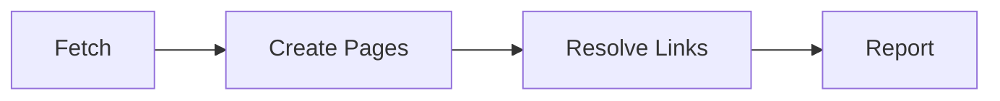

Export your documents back to Notion. The tool creates Notion pages from your KB documents, preserving structure, formatting, and cross-references.

<Tip>
If you have `@moxn/context-cli` installed, you can run `context export-notion` instead of `npx @moxn/kb-migrate export-notion`.
</Tip>

## Prerequisites

- Node.js 18+
- A **Notion integration token** with write access to your workspace
- A **Notion parent page** where exported pages will be created
- A **Moxn API key** with read permissions (create one at **Settings** > **API Keys** in the [web app](https://moxn.dev))

### Create a Notion Integration

If you don't already have one from importing:

1. Go to [notion.so/my-integrations](https://www.notion.so/my-integrations) and click **New integration**
2. Name it (e.g. "Moxn Exporter"), select your workspace, and click **Submit**
3. Copy the **Internal Integration Secret** — this is your `NOTION_TOKEN`
4. In Notion, open the parent page where you want exports to land
5. Click the **...** menu > **Connections** > **Connect to** and select your integration

<Note>
The integration needs **write access** to the parent page. If you already have an integration from importing, you can reuse it.
</Note>

## Quick Start

Export all documents to Notion:

```bash
npx @moxn/kb-migrate export-notion \
  --notion-token=$NOTION_TOKEN \
  --parent-page-id=YOUR_PAGE_ID \
  --api-key=$MOXN_API_KEY
```

Preview what would be exported:

```bash
npx @moxn/kb-migrate export-notion \
  --notion-token=$NOTION_TOKEN \
  --parent-page-id=YOUR_PAGE_ID \
  --api-key=$MOXN_API_KEY \
  --dry-run
```

Export only a subtree:

```bash
npx @moxn/kb-migrate export-notion \
  --notion-token=$NOTION_TOKEN \
  --parent-page-id=YOUR_PAGE_ID \
  --api-key=$MOXN_API_KEY \
  --base-path=/engineering
```

<Note>
You can set `NOTION_TOKEN` and `MOXN_API_KEY` as environment variables instead of passing them as flags.
</Note>

## How It Works

The export runs in two passes:



### 1. Fetch

The tool fetches documents from the Moxn API matching your filters (path prefix, date range).

### 2. Create Pages

Each document is created as a Notion page under your parent page. Sections become blocks:

| KB Content | Notion Result |
|-----------|---------------|
| Section heading | H2 heading block |
| Rich text | Paragraph blocks with formatting |
| Code blocks | Code block with language |
| Images | Image blocks (uploaded to Notion) |
| Mermaid diagrams | Code block with mermaid language |
| Tables | Table blocks |
| Lists | Bulleted/numbered list blocks |

### 3. Resolve Links

After all pages are created, the tool makes a second pass to convert internal KB document links into Notion page mentions, preserving cross-references.

### 4. Report

A summary shows what was created, skipped, or failed.

## Conflict Strategy

When you re-run the export and pages already exist in Notion:

**`--conflict-strategy=skip`** (default) — existing pages are left untouched:

```bash
npx @moxn/kb-migrate export-notion \
  --conflict-strategy=skip \
  --notion-token=$NOTION_TOKEN \
  --parent-page-id=PAGE_ID \
  --api-key=$MOXN_API_KEY
```

**`--conflict-strategy=update`** — existing pages are updated with the latest content:

```bash
npx @moxn/kb-migrate export-notion \
  --conflict-strategy=update \
  --notion-token=$NOTION_TOKEN \
  --parent-page-id=PAGE_ID \
  --api-key=$MOXN_API_KEY
```

<Note>
The tool matches existing pages by title. If you renamed a document in Moxn after a previous export, it will be created as a new page rather than updating the old one.
</Note>

## CLI Options

| Option | Default | Description |
|--------|---------|-------------|
| `--api-key <key>` | `$MOXN_API_KEY` | Moxn API key (required) |
| `--api-url <url>` | `https://moxn.dev` | Moxn API base URL |
| `--notion-token <token>` | `$NOTION_TOKEN` | Notion integration token (required) |
| `--parent-page-id <id>` | _(none)_ | Notion page under which to create pages (required) |
| `--base-path <path>` | `/` | Only export documents under this path prefix |
| `--conflict-strategy <strategy>` | `skip` | How to handle existing pages: `skip` or `update` |
| `--created-after <date>` | _(none)_ | Only include docs created after this date (ISO 8601) |
| `--created-before <date>` | _(none)_ | Only include docs created before this date (ISO 8601) |
| `--modified-after <date>` | _(none)_ | Only include docs modified after this date (ISO 8601) |
| `--modified-before <date>` | _(none)_ | Only include docs modified before this date (ISO 8601) |
| `--dry-run` | `false` | Preview without making changes |
| `--json` | `false` | Output results as JSON |

## Examples

### Export everything to Notion

```bash
npx @moxn/kb-migrate export-notion \
  --notion-token=$NOTION_TOKEN \
  --parent-page-id=$PARENT_PAGE_ID \
  --api-key=$MOXN_API_KEY
```

### Export a subtree

```bash
npx @moxn/kb-migrate export-notion \
  --notion-token=$NOTION_TOKEN \
  --parent-page-id=$PARENT_PAGE_ID \
  --api-key=$MOXN_API_KEY \
  --base-path=/engineering
```

### Update existing pages

```bash
npx @moxn/kb-migrate export-notion \
  --notion-token=$NOTION_TOKEN \
  --parent-page-id=$PARENT_PAGE_ID \
  --api-key=$MOXN_API_KEY \
  --conflict-strategy=update
```

### Export recent changes

```bash
npx @moxn/kb-migrate export-notion \
  --notion-token=$NOTION_TOKEN \
  --parent-page-id=$PARENT_PAGE_ID \
  --api-key=$MOXN_API_KEY \
  --modified-after=2026-03-01
```

### Dry run

```bash
npx @moxn/kb-migrate export-notion \
  --notion-token=$NOTION_TOKEN \
  --parent-page-id=$PARENT_PAGE_ID \
  --api-key=$MOXN_API_KEY \
  --dry-run
```

## Troubleshooting

<AccordionGroup>
  <Accordion title="Error: Notion token required">
    Pass your token via `--notion-token` or set the environment variable:

    ```bash
    export NOTION_TOKEN=secret_abc123...
    npx @moxn/kb-migrate export-notion --parent-page-id=PAGE_ID --api-key=KEY
    ```
  </Accordion>

  <Accordion title="Error: --parent-page-id is required">
    You must specify the Notion page where exported content will be created. Get the page ID from the URL — it's the 32-character hex string after the page title.
  </Accordion>

  <Accordion title="Pages are missing from Notion">
    The Notion integration must have write access to the parent page. In Notion, open the parent page, click **...** > **Connections** > **Connect to** and select your integration.
  </Accordion>

  <Accordion title="Cross-references aren't linking correctly">
    Internal links are resolved in a second pass after all pages are created. If the target document wasn't included in the export (e.g., filtered out by `--base-path`), the link is left as plain text.
  </Accordion>

  <Accordion title="Export is slow">
    The Notion API has rate limits (~3 requests/second). For large workspaces, expect the export to take a few minutes. Use `--base-path` or date filters to export a smaller subset.
  </Accordion>
</AccordionGroup>

## Next Steps

<CardGroup cols={2}>
  <Card title="Import from Notion" icon="arrow-right-to-bracket" href="/migration/notion">
    Import Notion content back into Moxn
  </Card>
  <Card title="Export to Local Files" icon="file-export" href="/migration/export-local">
    Download as markdown files instead
  </Card>
</CardGroup>
