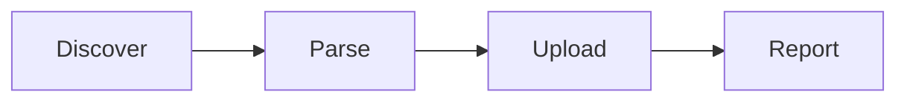

Import existing documentation from your filesystem into Moxn. The `@moxn/kb-migrate` CLI reads markdown and text files, splits them into sections, uploads images, and creates documents via the API.

<Tip>
If you have `@moxn/context-cli` installed, you can run `context import-local` instead of `npx @moxn/kb-migrate local`.
</Tip>

## Prerequisites

- Node.js 18+
- A Moxn API key with **read and write** permissions (create one at **Settings** > **API Keys** in the [web app](https://moxn.dev))
- A directory of `.md` or `.txt` files to import

<Note>
Make sure your API key has **read/write** access, not read-only. The migration tool needs write access to create documents and upload images.
</Note>

## Quick Start

Point the tool at the local directory you want to import. In these examples, `./docs` is the folder on your filesystem containing the markdown files:

```bash
npx @moxn/kb-migrate local ./docs --api-key=YOUR_API_KEY
```

Preview what would happen without making changes:

```bash
npx @moxn/kb-migrate local ./docs --api-key=YOUR_API_KEY --dry-run
```

Import under a specific path prefix:

```bash
npx @moxn/kb-migrate local ./docs --api-key=YOUR_API_KEY --base-path=/guides
```

Replace `./docs` with the path to your own documentation directory.

<Note>
You can also set `MOXN_API_KEY` as an environment variable instead of passing `--api-key` every time.
</Note>

## How It Works

The migration tool processes your files in four steps:



### 1. Discover

The tool scans your directory recursively for matching files. By default it picks up `.md` and `.txt` files. It ignores `node_modules/` and `.git/` directories.

### 2. Parse

Each file is parsed into a document with sections:

- **H2+ headers** (`##`, `###`, etc.) become section boundaries
- Content between headers becomes the section body
- Files with no H2 headers get a single "Content" section
- **Local images** (e.g., ``) are uploaded as assets
- **External images** (e.g., ``) are kept as URL references
- Code blocks, formatting, and lists are preserved

### 3. Upload

Each document is created via the API:

- **201** — document created
- **409** — document already exists at that path, handled by the `--on-conflict` option
- **Other errors** — marked as failed, remaining files continue processing

### 4. Report

A summary is printed with counts and timing:

```
(1/3) ✓ Created: /guides/getting-started (3 sections)
(2/3) - Skipped: /guides/api-reference (already exists)
(3/3) ✗ Failed: /guides/broken-doc (Network error)

--- Migration Summary ---
Total: 3 | Created: 1 | Skipped: 1 | Failed: 1
```

## Document Path Mapping

The tool constructs KB paths from the file's relative path:

| Source File | `--base-path` | KB Document Path |
|-------------|---------------|------------------|
| `guide.md` | `/` (default) | `/guide` |
| `guide.md` | `/imported` | `/imported/guide` |
| `deep/nested.md` | `/docs` | `/docs/deep/nested` |
| `a/b/c/file.txt` | `/` | `/a/b/c/file` |

File extensions are stripped. The document **name** is derived from the filename in title case (e.g., `api-guide.md` becomes "Api Guide").

<Warning>
**Filenames with spaces** are automatically sanitized — spaces are replaced with hyphens. For example, `my file.md` becomes path `/my-file`. A warning is shown when this happens.
</Warning>

## Section Parsing

Sections are created from H2+ headers in your markdown:

```markdown
# Page Title

Intro text before any H2.

## Installation        ← Section 1: "Installation"

Install instructions...

## Configuration       ← Section 2: "Configuration"

Config details...

## Usage               ← Section 3: "Usage"

Usage instructions...
```

This produces a document with 3 sections. Content before the first H2 header is included in the first section.

Files with **no H2 headers** produce a single section named "Content" containing the entire file.

## CLI Options

| Option | Default | Description |
|--------|---------|-------------|
| `--api-key <key>` | `$MOXN_API_KEY` | API authentication key (required) |
| `--api-url <url>` | `https://moxn.dev` | API base URL (for local dev, e.g. `http://localhost:3000`) |
| `--base-path <path>` | `/` | Path prefix for all imported documents |
| `--extensions <exts>` | `.md,.txt` | Comma-separated file extensions to include |
| `--on-conflict <action>` | `skip` | What to do when a path already exists: `skip` or `update` |
| `--default-permission <perm>` | Server default | Default permission level: `edit`, `read`, or `none` |
| `--ai-access <perm>` | Server default | AI/MCP access level: `edit`, `read`, or `none` |
| `--created-after <date>` | _(none)_ | Only include files created after this date (ISO 8601) |
| `--created-before <date>` | _(none)_ | Only include files created before this date (ISO 8601) |
| `--modified-after <date>` | _(none)_ | Only include files modified after this date (ISO 8601) |
| `--modified-before <date>` | _(none)_ | Only include files modified before this date (ISO 8601) |
| `--dry-run` | `false` | Preview changes without calling the API |
| `--json` | `false` | Output results as JSON |

## Handling Conflicts

When you import files to a path that already has a document:

**`--on-conflict=skip`** (default) — Existing documents are left untouched:

```bash
npx @moxn/kb-migrate local ./docs --api-key=KEY --base-path=/guides
# First run: creates all documents
# Second run: skips all (already exist)
```

**`--on-conflict=update`** — Existing documents are updated with the new content:

```bash
npx @moxn/kb-migrate local ./docs --api-key=KEY --base-path=/guides --on-conflict=update
# Re-imports and updates all documents, creating new versions
```

Updates create new commits in the document's history — the previous version is preserved.

## Setting Permissions

Control who can access your imported documents:

```bash
npx @moxn/kb-migrate local ./docs \
  --api-key=KEY \
  --default-permission=read \
  --ai-access=none
```

| Permission | `edit` | `read` | `none` |
|------------|--------|--------|--------|
| **`--default-permission`** | Team members can edit | Team members can view only | Hidden from team |
| **`--ai-access`** | AI assistants can read and write | AI assistants can read only | Hidden from AI |

See [Permissions](/concepts/permissions) for details on how the permission model works.

## Custom File Extensions

By default, only `.md` and `.txt` files are imported. To import other file types:

```bash
npx @moxn/kb-migrate local ./docs --api-key=KEY --extensions=.mdx,.markdown
```

<Warning>
If two files in the same directory differ only by extension (e.g., `doc.mdx` and `doc.markdown`), they map to the same KB path. The tool will warn you and keep only the first match.
</Warning>

## JSON Output

Use `--json` to get structured output for scripting or CI integration:

```bash
npx @moxn/kb-migrate local ./docs --api-key=KEY --json
```

Returns a `MigrationLog` object:

```json
{
  "timestamp": "2026-02-04T12:00:00.000Z",
  "source": { "type": "local", "location": "./docs" },
  "targetApi": "https://moxn.dev",
  "basePath": "/",
  "options": { "dryRun": false, "onConflict": "skip" },
  "results": [
    {
      "sourcePath": "guide.md",
      "documentPath": "/guide",
      "status": "created",
      "sectionsCount": 4,
      "duration": 1200
    }
  ],
  "summary": {
    "total": 1,
    "created": 1,
    "updated": 0,
    "skipped": 0,
    "failed": 0,
    "duration": 1200
  }
}
```

## Examples

### Import project documentation

```bash
npx @moxn/kb-migrate local ./docs \
  --api-key=KEY \
  --base-path=/engineering/project-x
```

### Preview before importing

```bash
npx @moxn/kb-migrate local ./docs \
  --api-key=KEY \
  --base-path=/engineering/project-x \
  --dry-run
```

### Re-sync after updating local files

```bash
npx @moxn/kb-migrate local ./docs \
  --api-key=KEY \
  --base-path=/engineering/project-x \
  --on-conflict=update
```

### Import with restricted AI access

```bash
npx @moxn/kb-migrate local ./docs \
  --api-key=KEY \
  --base-path=/internal \
  --default-permission=read \
  --ai-access=none
```

## Troubleshooting

<AccordionGroup>
  <Accordion title="'npx' is not recognized">
    You need Node.js installed. Download it from [nodejs.org](https://nodejs.org) (choose the LTS version). After installing, restart your terminal.
  </Accordion>

  <Accordion title="Error: API key required">
    Either pass `--api-key=YOUR_KEY` or set the `MOXN_API_KEY` environment variable:

    ```bash
    export MOXN_API_KEY=your_key_here
    npx @moxn/kb-migrate local ./docs
    ```
  </Accordion>

  <Accordion title="Some files failed but others succeeded">
    The tool continues processing remaining files when one fails. Check the summary output for failed files and their error messages. Common causes:

    - Network errors (transient — retry the import with `--on-conflict=skip`)
    - Invalid file content
  </Accordion>

  <Accordion title="Images aren't showing up in my documents">
    Make sure image paths in your markdown are correct relative to the markdown file's location. The tool resolves `` relative to the `.md` file.

    External image URLs (e.g., `https://...`) are kept as-is and require the URL to be publicly accessible.
  </Accordion>

  <Accordion title="Path collision warning">
    This happens when two source files map to the same KB path (e.g., `doc.md` and `doc.txt` in the same directory). The tool keeps the first match and warns about duplicates. Rename one of the source files to avoid the collision.
  </Accordion>
</AccordionGroup>

## Next Steps

<CardGroup cols={2}>
  <Card title="Concepts" icon="book" href="/concepts/documents-and-sections">
    Learn about documents, branches, and permissions
  </Card>
  <Card title="Connect AI Assistants" icon="robot" href="/quickstart-documents">
    Set up MCP access so AI can use your imported docs
  </Card>
</CardGroup>
