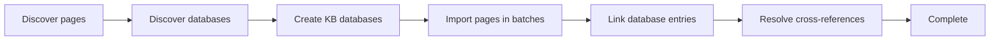

The in-app Notion integration is the easiest way to move Notion content in and out of Moxn. Connect your Notion workspace once in **Settings > Integrations**, pick what to sync, and Moxn runs the job on its own infrastructure with live progress in the dialog.

<Tip>
Prefer the command line, scripted runs, or CI? See [Import from Notion (CLI)](/migration/notion) and [Export to Notion (CLI)](/migration/export-notion). Both flavors share the same migration engine — they just differ in where the job runs and how you trigger it.
</Tip>

## When to use this vs. the CLI

| | In-app integration | CLI |
|---|---|---|
| **Where it runs** | Moxn's infrastructure | Your machine or CI runner |
| **Setup** | Paste a Notion token in the web app | `npx @moxn/kb-migrate` + Node 18+ |
| **Page selection** | Browse and click in the dialog | `--root-page-id` or `--selected-page-ids` flags |
| **Progress** | Live UI with per-stage status | Streaming console output |
| **Best for** | One-off imports, non-technical teammates, large workspaces you don't want to babysit | Repeatable / scripted runs, CI, fine-grained flag control |

Both routes use the same `@moxn/kb-migrate` engine under the hood, so the resulting documents, sections, databases, tags, and cross-references are identical.

## Prerequisites

- A Moxn account ([moxn.dev](https://moxn.dev)) on a plan that includes imports
- A **Notion integration token** with access to the pages you want to sync (see [Create a Notion Integration](/migration/notion#step-1-create-a-notion-integration))

<Note>
The Notion token is stored encrypted in Moxn and reused across import and export jobs. You only need to paste it once per workspace; **Disconnect** removes it.
</Note>

## Import from Notion

### Step 1: Open the integration

1. In the Moxn web app, go to **Settings > Integrations**
2. Find the **Notion** card and click **Import from Notion**

If this is your first time, the dialog opens at the **Connect** step. If you've connected before, it skips straight to **Select**.

### Step 2: Connect your workspace

Paste your Notion integration token and click **Connect**. Moxn validates the token against the Notion API and stores it encrypted, then shows your workspace name as the **Connected** badge on the integrations page.

### Step 3: Select pages

The dialog lists every page and database the integration can see. You can:

- Search by title
- Select individual pages or databases
- **Select all** / **Deselect all** within the current search filter

Database entries are imported automatically when you select their parent database — you don't need to pick them individually.

### Step 4: Configure the import

| Setting | Default | Notes |
|---|---|---|
| **Path prefix** | `/imported/notion/` | Where the new documents land in the KB |
| **Conflict strategy** | `skip` | Or `update` to overwrite existing documents at the same path |
| **Default permission** | `read` | Team-member access: `edit`, `read`, or `none` |
| **AI access** | `edit` | Agent access via MCP: `edit`, `read`, or `none` |
| **Filesystem** | _(default)_ | If your workspace has multiple [filesystems](/concepts/filesystems) |
| **Date filter** | _(none)_ | `Modified after` / `Modified before` to scope by recency |

See [Permissions](/concepts/permissions) for how `default-permission` and `ai-access` interact.

### Step 5: Run and watch

Click **Start import**. Moxn creates a job record and hands it to a background runner that:

The dialog polls job status every two seconds and shows the current stage, completed/failed/skipped counts, and per-page results. You can close the dialog and reopen it later — the job keeps running.

### Cancelling

Click **Cancel** at any time during the **Progress** step. Pages already imported stay in the KB; in-flight pages finish and the job is marked cancelled.

## Export to Notion

The export flow mirrors the import flow:

1. **Settings > Integrations** > **Export to Notion**
2. The same stored Notion token is reused (the **Connected** badge must show before export is enabled)
3. Pick the KB documents to push and the destination Notion parent page
4. The export job runs server-side and reports progress in the same dialog

For details on what's preserved across the round trip (sections, images, databases, tag-backed columns), see [Export to Notion (CLI)](/migration/export-notion#what-gets-exported) — the in-app and CLI exports use the same converter.

<Note>
The Notion token used for export needs **write access** to the destination parent page. In Notion, open the parent, click **...** > **Connections** > **Connect to** and select your integration.
</Note>

## Disconnecting

Click **Disconnect** on the Notion card to remove the stored token. Future imports or exports will require pasting a fresh token. Existing documents in the KB are not affected.

## Limits and behavior

| Constraint | Details |
|---|---|
| **Page batch size** | 50 pages per batch — progress is persisted between batches, so a crashed job can resume on its next batch |
| **Max documents per job** | Same limit as the CLI (10,000). Use the date filter or import a subtree if your workspace is larger |
| **Database properties** | Only **Select** and **Multi-select** become KB database columns; other property types appear as text in the page body |
| **Rate limits** | Moxn throttles Notion API calls to stay under Notion's ~3 req/sec limit |
| **Cross-references** | Notion page mentions become KB document links once both source and target pages have been imported |

## Troubleshooting

<AccordionGroup>
  <Accordion title="Imports disabled on free plan">
    The in-app integration requires a paid plan. The CLI works on any plan since it runs on your own machine — see [Import from Notion (CLI)](/migration/notion) if you'd rather not upgrade.
  </Accordion>

  <Accordion title="Pages I expected aren't in the Select step">
    The Notion integration can only see pages it's been explicitly connected to. In Notion, open the parent page, click **...** > **Connections** > **Connect to** and select your integration. Child pages inherit access from their parent.
  </Accordion>

  <Accordion title="Job is stuck on a stage">
    Reopen the dialog — progress polls every two seconds and the stage label updates as the runner advances. If the same stage persists for several minutes on a large workspace, check the job again later; large database link or cross-reference passes can take a while without visible progress.
  </Accordion>

  <Accordion title="Some pages failed but others succeeded">
    Per-page failures don't stop the job. The **Complete** step shows a list of failed pages with their error messages. Re-run the import with **Conflict strategy: skip** to retry only the failures.
  </Accordion>
</AccordionGroup>

## Next Steps

<CardGroup cols={2}>
  <Card title="Import from Notion (CLI)" icon="terminal" href="/migration/notion">
    Run the same import from your terminal or CI
  </Card>
  <Card title="Export to Notion (CLI)" icon="arrow-right-from-bracket" href="/migration/export-notion">
    Push KB docs back to Notion from the command line
  </Card>
  <Card title="Concepts" icon="book" href="/concepts/documents-and-sections">
    How documents, sections, branches, and permissions work
  </Card>
  <Card title="Connect AI Assistants" icon="robot" href="/quickstart-documents">
    Set up MCP access so agents can use your imported docs
  </Card>
</CardGroup>
