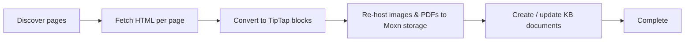

The in-app OneNote integration is the easiest way to move OneNote content into Moxn. Sign in with your Microsoft account once in **Settings > Integrations**, browse your notebooks, pick what to import, and Moxn runs the job on its own infrastructure with live progress.

<Tip>
Today, OneNote is **import-only** — there is no export-to-OneNote yet, and there is no CLI flavor (unlike Notion). All OneNote work happens in the web app.
</Tip>

## When to use this

| You want to… | Use this |
|---|---|
| Bring a OneNote notebook (or a few sections) into Moxn so agents and teammates can work on it | OneNote integration |
| Bulk import from Notion or local files | [Notion integration](/migration/notion-integration), [Notion CLI](/migration/notion), or [Local Files CLI](/migration/local) |
| Export Moxn content to OneNote | _(not supported yet)_ — use [Local Files (CLI)](/migration/export-local) for a markdown copy |

## Prerequisites

- A Moxn account on a plan that includes imports
- A Microsoft account with at least one OneNote notebook — both **personal Microsoft accounts** (`@outlook.com`, `@hotmail.com`, `@live.com`, Skype, Xbox) and **work / school accounts** (Microsoft Entra ID) are supported
- Browser pop-ups allowed for `login.microsoftonline.com` so the OAuth window can open

<Note>
Moxn stores the OAuth refresh token encrypted and uses it to mint short-lived access tokens for each import. **Disconnect** removes the stored token. Moxn never sees your Microsoft password.
</Note>

## Import from OneNote

### Step 1: Open the integration

In the Moxn web app, go to **Settings > Integrations** and click **Import from OneNote**.

<Frame>
   Integrations page with the Microsoft OneNote card and Import from OneNote button" />
</Frame>

If this is your first time, the dialog opens at the **Connect** step — click **Continue with Microsoft**, sign in, and grant the requested OneNote permissions. If you've connected before, the dialog skips straight to **Select** and the integration card shows **Connected — _your-email_**.

### Step 2: Select notebooks, sections, or pages

The dialog shows your full OneNote hierarchy — every notebook, section group, section, and page the integration can see. You can:

- **Filter by name** to narrow the tree
- **Select a notebook** to import everything inside it
- **Drill in** and select individual section groups, sections, or single pages
- Click the open-in-OneNote arrow next to any notebook to view it on onenote.com

<Frame>
  
</Frame>

A summary at the bottom (`N items selected`) updates as you check boxes. Click **Next** to continue.

### Step 3: Configure the import

| Setting | Default | Notes |
|---|---|---|
| **Destination path prefix** | `/imported/onenote` | Where the new documents land in the KB. Each notebook becomes a sub-folder, with section groups and sections as nested folders. |
| **If document exists** | `Skip (keep existing)` | Or `Update (overwrite sections)` to replace existing content at the same path |
| **Default permission** | `Read (workspace members)` | Workspace-member access: `edit`, `read`, or `none` |
| **AI / MCP access** | `Edit (AI can read and modify)` | Agent access via MCP: `edit`, `read`, or `none` |
| **Modified after / before** | _(none)_ | ISO date filter to scope by recency |

See [Permissions](/concepts/permissions) for how `default-permission` and `ai-access` interact.

<Frame>
  
</Frame>

### Step 4: Run and watch

Click **Start import**. Moxn creates a job record and hands it to a Trigger.dev background worker that:

Per-page work fans out with a concurrency cap so the Microsoft Graph API isn't overwhelmed. The dialog polls job status and shows the running stage, completed/failed/skipped counts, and per-page results. You can close the dialog and reopen it later — the job keeps running.

### Step 5: Open the imported docs

Each OneNote page becomes one Moxn document under your destination path. The page title becomes the document name; OneNote H2 headings become section breaks (so a long page becomes multiple sections you can navigate, edit, and permission independently).

<Frame>
  
</Frame>

## What gets converted

| OneNote element | Moxn rendering |
|---|---|
| Page title (H1) | Document name |
| H2 headings | Section break — H2 becomes the section name |
| H3 / paragraphs / bold / italic | Preserved inline |
| Bullet / numbered lists | `bulletList` / `orderedList` |
| Tables | Real Moxn table; first row becomes header (bold) |
| Inserted images (PNG/JPG) | Re-hosted to Moxn storage and embedded as `imageBlock` |
| File attachments (PDF, etc.) | Re-hosted and shown as a `fileBlock` card with double-click preview |
| To-do tags (`☐` / `☑`) | TipTap `taskList` items, checked state preserved |
| **Important** tag (⭐) | Paragraph prefixed with ⭐ |
| **Question** tag (❓) | Paragraph prefixed with ❓ |
| **Idea** tag (💡) | Paragraph prefixed with 💡 |
| Page-to-page links inside the same notebook | Preserved as Moxn cross-reference links once both source and target pages have been imported |

Anything OneNote returns as an inline image or attachment is downloaded once during import and uploaded to your workspace's Moxn-managed storage — the Moxn document keeps a stable signed URL, so it won't break if you later revoke OneNote access.

## Disconnecting

Click **Disconnect** on the OneNote card to remove the stored OAuth refresh token. Future imports will require signing in again. Existing imported documents are not affected.

## Limits and behavior

| Constraint | Details |
|---|---|
| **Page concurrency** | 4 pages imported in parallel (Trigger.dev queue) — Microsoft doesn't publish a per-tenant Graph rate limit for OneNote, so we stay conservative |
| **Attachment cap** | 50 MB per file — anything larger is skipped (the page still imports without that attachment) |
| **Page batch retries** | 3 attempts per page with exponential backoff (5s, 10s, 20s) before the page is marked failed |
| **Job retries** | Per-page failures don't stop the job — the orchestrator returns success with a per-page result list |
| **Conflict strategy** | `skip` keeps the existing KB document; `update` overwrites all sections from the OneNote source on the document's default branch |
| **Path scheme** | `<prefix>/<notebook-slug>/<section-group-slug>/<section-slug>/<page-slug>` — slugs come from OneNote names with spaces and special characters normalized for Moxn's `ltree` paths |

## Troubleshooting

<AccordionGroup>
  <Accordion title="Microsoft login pop-up blocked">
    Most browsers block pop-ups by default. When you click **Continue with Microsoft**, allow pop-ups for `login.microsoftonline.com` and click again. The OAuth window opens, you sign in once, and the dialog returns to the Select step.
  </Accordion>

  <Accordion title="Tree shows fewer notebooks than I expect">
    Moxn requests the `Notes.Read` Microsoft Graph scope, which gives access to **OneNote notebooks owned by or shared with the signed-in account**. Notebooks shared via a SharePoint group you don't directly belong to may not appear. Check what the same account can see at [onenote.com](https://onenote.com) — the Moxn tree mirrors that view.
  </Accordion>

  <Accordion title="A page failed to import">
    Per-page failures appear in the **Complete** step with the underlying error. Common causes:

    - **Attachment too large** — files > 50 MB are skipped, and if a page is mostly an oversized attachment it may be marked failed
    - **Microsoft Graph 5xx** — transient — re-run the import with **Conflict strategy: skip** to retry only the failures
    - **Unsupported HTML** — very rare; the page imports as text-only with the offending block dropped (logged as a warning)
  </Accordion>

  <Accordion title="Re-importing didn't update an existing page">
    Make sure you set **If document exists** to **Update (overwrite sections)** in the Configure step. The default is `skip`, which leaves existing documents untouched.

    `Update` replaces the document's sections from the OneNote source on the default branch. If you have feature branches with manual edits, those are unaffected — `update` writes to the default branch only.
  </Accordion>

  <Accordion title="Images show as broken or 1×1">
    Imported images are re-hosted to Moxn storage and served via signed URLs that auto-refresh. If you see a broken image or a 1×1 pixel where a chart should be:

    1. **Refresh the page** — the editor will mint a new signed URL
    2. If the image is genuinely 1×1 in OneNote (placeholder, OCR-failed thumbnail), the import faithfully re-hosts it that way — fix it in OneNote and re-import with `update`
  </Accordion>

  <Accordion title="`Connected — Checking…` never resolves">
    The integrations page calls Microsoft Graph to verify the stored token is still valid. If the token is revoked or expired and the refresh token is invalid (e.g. you changed your Microsoft password), the badge shows **Not connected** after a few seconds. Click **Disconnect**, then **Import from OneNote** to re-authorize.
  </Accordion>

  <Accordion title="Imports disabled on free plan">
    The in-app integration requires a paid plan. There is no CLI alternative for OneNote at this time.
  </Accordion>
</AccordionGroup>

## Next Steps

<CardGroup cols={2}>
  <Card title="Concepts: Documents & Sections" icon="book" href="/concepts/documents-and-sections">
    How H2 splits become sections you can permission and merge independently
  </Card>
  <Card title="Notion Integration" icon="bolt" href="/migration/notion-integration">
    Bring a Notion workspace into Moxn the same way
  </Card>
  <Card title="Filesystems" icon="folder-tree">
    [Organize imports](/concepts/filesystems) into multiple isolated content roots
  </Card>
  <Card title="Connect AI Assistants" icon="robot" href="/quickstart-documents">
    Set up MCP so agents can use your imported notebooks
  </Card>
</CardGroup>
