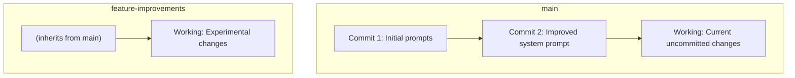

Moxn uses Git-like version control for prompts. This guide covers branching, committing, and managing versions in the web app.

## Understanding Branches

A **branch** is an isolated workspace for changes:

- **main**: The default branch (like Git's main/master)
- **Feature branches**: For experimentation and development



## Creating Branches

<Steps>
  <Step title="Open branch selector">
    Click the branch dropdown in the header.
  </Step>
  <Step title="Click Create Branch">
    Select **Create new branch**.
  </Step>
  <Step title="Name your branch">
    Use descriptive names:
    - `feature-better-prompts`
    - `experiment-new-tone`
    - `fix-edge-case`
  </Step>
  <Step title="Create">
    Click **Create** to create and switch to the new branch.
  </Step>
</Steps>

### Branch Selector

<Frame>
  
</Frame>

The branch dropdown shows:
- Current branch (with checkmark)
- All available branches
- Option to create new branch

### Git Actions Menu

<Frame>
  
</Frame>

Click **Git Actions** to:
- Create a new branch
- Create a merge request
- View branch settings

### Branch Naming

Good branch names:
- `feature-multilingual-support`
- `experiment-shorter-responses`
- `fix-formatting-issue`

Avoid:
- `test`
- `my-branch`
- `changes`

## Switching Branches

To switch between branches:

1. Click the branch dropdown
2. Select the branch you want
3. Your view updates to show that branch's content

<Note>
Uncommitted changes stay on their branch when you switch.
</Note>

## Making Changes

### Working State

Changes you make are saved as **working state**:

- Automatically saved as you edit
- Visible only on your current branch
- Not visible to others until you commit

### What Counts as a Change

- Editing message content
- Adding or removing messages
- Modifying prompt settings
- Adding or removing properties
- Changing schemas

## Committing Changes

When you're ready to save a snapshot:

<Steps>
  <Step title="Review changes">
    Check the **Changes** panel to see what's modified.
  </Step>
  <Step title="Click Commit">
    Click the **Commit** button.
  </Step>
  <Step title="Write a message">
    Describe what you changed:
    - "Improved system prompt for clarity"
    - "Added context variable for search results"
    - "Fixed typo in greeting"
  </Step>
  <Step title="Confirm">
    Click **Commit** to create the snapshot.
  </Step>
</Steps>

### Commit Messages

Write clear commit messages:

Good:
- "Add multilingual greeting support"
- "Reduce system prompt length for faster responses"
- "Add search_results variable for RAG"

Avoid:
- "Updates"
- "Fixed stuff"
- "."

## Viewing History

See the commit history for your branch:

<Steps>
  <Step title="Open commit selector">
    Click the commit dropdown (shows current commit or "Working").
  </Step>
  <Step title="Browse commits">
    See all commits with:
    - Commit message
    - Timestamp
    - Changes summary
  </Step>
  <Step title="Select a commit">
    Click to view that commit's snapshot.
  </Step>
</Steps>

### Commit History

<Frame>
  
</Frame>

The commit selector shows:
- **Latest**: Current working state
- **Commit history**: Past snapshots with messages and timestamps
- Click any commit to view that version

### Viewing Past Versions

When viewing a past commit:
- Content is **read-only**
- You're seeing exactly what was committed
- Make changes by switching back to "Working"

## Comparing Versions

Compare different versions:

1. Select the first commit/version
2. Click **Compare**
3. Select the second commit/version
4. See a diff view showing changes

## Rolling Back

To revert to a previous version:

<Steps>
  <Step title="View the commit">
    Select the commit you want to restore.
  </Step>
  <Step title="Click Restore">
    Click **Restore to this version**.
  </Step>
  <Step title="Confirm">
    This creates new working state matching that commit.
  </Step>
  <Step title="Commit">
    Commit the restored state with a message like "Revert to commit abc123".
  </Step>
</Steps>

## Merging Branches

To merge changes from one branch to another:

<Steps>
  <Step title="Switch to target">
    Switch to the branch you want to merge INTO (e.g., main).
  </Step>
  <Step title="Click Merge">
    Click **Merge** and select the source branch.
  </Step>
  <Step title="Review changes">
    See what will be merged.
  </Step>
  <Step title="Resolve conflicts">
    If there are conflicts, choose which version to keep.
  </Step>
  <Step title="Complete merge">
    Click **Merge** to apply the changes.
  </Step>
</Steps>

## Deployment Workflow

### Development

1. Create feature branch
2. Make changes
3. Test in Studio
4. Commit when satisfied
5. Merge to main

### Production

1. Get latest commit ID from main
2. Update code to use that commit ID
3. Deploy

In code:

```python
# Production: pinned to commit
session = await client.create_prompt_session(
    prompt_id="...",
    commit_id="abc123def456"  # From your deployment config
)
```

## Branch Protection

<Warning>
Consider protecting your main branch to prevent accidental changes.
</Warning>

Protection options:
- Require reviews before merging
- Require commit messages
- Lock branch from direct edits

## Best Practices

<AccordionGroup>
  <Accordion title="Commit early and often">
    Small, frequent commits are easier to track and revert.
  </Accordion>
  <Accordion title="Use feature branches">
    Don't experiment directly on main. Create branches.
  </Accordion>
  <Accordion title="Write good commit messages">
    Future you will thank present you.
  </Accordion>
  <Accordion title="Test before committing">
    Use the Studio to verify prompts work as expected.
  </Accordion>
  <Accordion title="Pin production to commits">
    Never use branch names in production. Always use commit IDs.
  </Accordion>
</AccordionGroup>

## Next Steps

<CardGroup cols={2}>
  <Card title="Versioning Concept" icon="code-branch" href="/concepts/versioning">
    Deep dive into versioning
  </Card>
  <Card title="Working with Prompts" icon="file-lines" href="/guides/prompts">
    Access versions in code
  </Card>
  <Card title="Creating Tasks" icon="folder-plus" href="/webapp/creating">
    Create new content
  </Card>
  <Card title="Telemetry" icon="chart-line" href="/telemetry/reviewing">
    Track which versions are used
  </Card>
</CardGroup>
